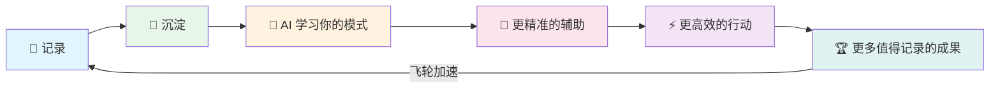

# AI本体论：从工具到基础物质的认知跃迁

# AI 本体论：从工具到基础物质

## 核心观点

### 1. AI 是基础物质，不是工具

**原始洞察**：AI 不是工具，而是一种基础物质。

**深化思考**：
- 工具思维：「AI 能帮我做什么？」——这是消费者视角
- 物质思维：「AI 能替代组织中的哪些工作流？成本结构如何重构？」——这是架构师视角

正如电力不是「帮人点灯的工具」，而是重塑了整个工业生产的基础设施。AI 的真正价值不在于「减轻负担」，而在于**重新定义价值创造的单位成本**。

**关键问题框架**：
- 这个流程的人力成本是多少？
- AI 替代后的边际成本是多少？
- 替代后释放的人力可以创造什么新价值？

---

### 2. ALL IN AI：用 AI 抽象一切

**原始洞察**：生活工作中所有内容，都理应用 AI 来抽象。

**深化思考**：

「抽象」的本质是**降低认知负载**。AI 的核心能力恰恰是：
- 信息压缩（summarize）
- 模式识别（pattern recognition）
- 意图理解（intent parsing）

**实践原则**：
- 输入层：所有信息流入先经 AI 预处理（过滤、分类、摘要）
- 处理层：决策前让 AI 生成选项和风险分析
- 输出层：表达前让 AI 优化结构和措辞

**警惕陷阱**：
- ALL IN ≠ 盲目依赖，而是「AI 辅助 + 人类决策」的系统化
- 保留对 AI 输出的批判性审视能力

---

### 3. 记录 + AI = 复利飞轮

**原始洞察**：保持记录，保持沉淀，AI + 沉淀会加速成为恐怖的增长飞轮。

**深化思考**：

**飞轮的三个加速器**：

1. **结构化沉淀**：不只是「记」，而是用统一格式记录（便于 AI 解析）
2. **高频回顾**：定期让 AI 分析你的记录，发现你自己看不到的模式
3. **迭代反馈**：用 AI 的分析结果指导下一轮行动，形成闭环

**复利公式**：
- 传统成长：能力 = 经验 × 反思频率
- AI 增强：能力 = 经验 × 反思频率 × AI 洞察深度 × 记录完整度

---

## 行动指南

1. **今天开始**：任何工作流程，先问「AI 能替代哪个环节？」
2. **本周实践**：选一个日常任务，全程用 AI 辅助，记录效率变化
3. **长期坚持**：每日记录，每周 AI 复盘，每月迭代工作流

---

> 「AI 时代的核心竞争力，不是会用 AI，而是会用 AI 重构自己的操作系统。」