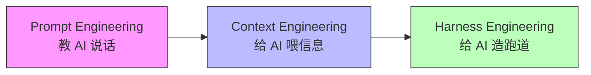
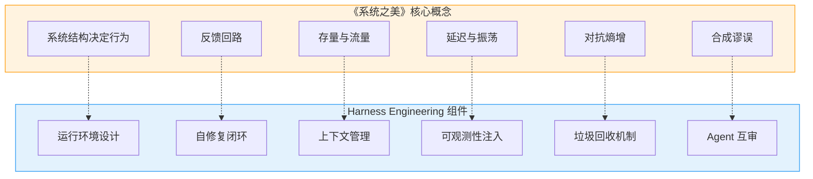
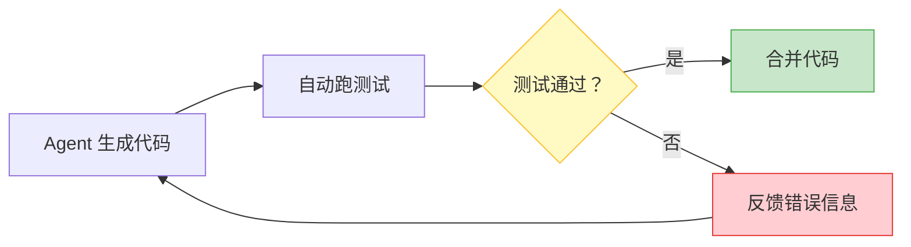
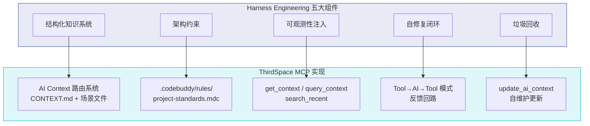
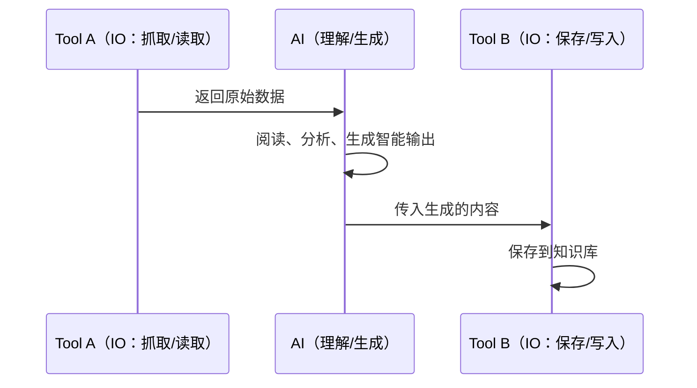
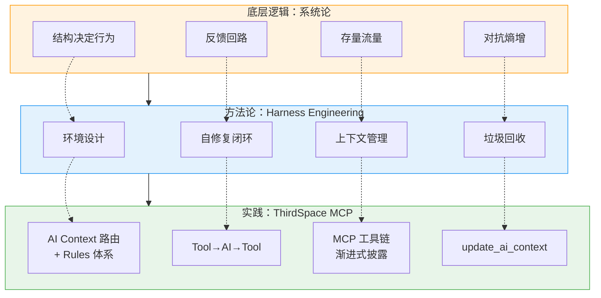

# 从《系统之美》到 Harness Engineering：用系统论重新理解 AI 工程

最近读完德内拉·梅多斯的《系统之美》，正好赶上 AI Agent 领域最热的话题——Harness Engineering（驾驭工程）。读着读着我发现，这两件看起来毫不相干的事，底层逻辑竟然是同一套。

这篇文章想讲三件事：Harness Engineering 到底是什么、它和系统论的映射关系、以及我用 ThirdSpace MCP 做的实践是怎么暗合这套逻辑的。

---

## 一、Harness Engineering：不是教 AI 说话，是给 AI 造环境

2026 年 2 月，OpenAI 工程师 Ryan Lopopolo 发了一篇博文，披露了一个持续 5 个月的实验：3 名工程师不写一行代码，纯靠 Codex Agent 生成了约 100 万行代码，交付了一款真实产品的内测版。

关键数据：约 1500 个 PR，开发速度约为手写的 10 倍，单次 Agent 运行最长超过 6 小时。

但真正让我在意的不是这些数据，而是工程师 80% 的时间花在了哪——**不是写 Prompt，不是审代码，而是构建 Harness**。

什么是 Harness？Anthropic 给了一个精确定义：

> Agent Harness（或称 scaffold）是让模型能够作为 Agent 工作的系统：它处理输入、编排工具调用、返回结果。

翻译成人话：**Harness 不是 Agent 本身，而是 Agent 运行的那层环境。**

三代 AI 工程范式的演进可以这样理解：

| 范式 | 优化对象 | 核心动作 | 比喻 |
|------|----------|----------|------|
| Prompt Engineering | 输入措辞 | 跟 AI 说话 | 骑手喊口令 |
| Context Engineering | 信息输入 | 给 AI 喂文档 | 给马看地图 |
| Harness Engineering | 运行环境 | 给 AI 造跑道 | 给马套缰绳 + 修护栏 |

**核心思维转变：当 AI 犯错，正确的回应不是换模型、不是改 Prompt，而是重新设计它运行的环境。**

---

## 二、系统论映射：梅多斯早就讲清了底层逻辑

读《系统之美》的时候我一直在想，梅多斯 1972 年就在讲的东西，为什么 2026 年突然在 AI 工程里被重新发现了？

答案是：**系统论从来不过时，只是需要新的载体来兑现。**

Harness Engineering 的五大组件，和系统论的核心概念几乎一一对应：

逐条展开：

### 2.1 系统结构决定行为 → 环境决定 AI 输出质量

梅多斯说：「系统的内在结构决定了我们所不愿意看到的行为特征。」

Harness Engineering 说：「决定结果好坏的最大变量，不是模型有多聪明，而是模型被放在什么样的环境里。」

一模一样的话，隔了半个世纪。

这意味着：与其纠结用 GPT-4o 还是 Claude Opus，不如花时间设计更好的约束和工具链。**模型是要素，Harness 是结构。梅多斯告诉我们，改变要素对系统影响最小，改变结构才是根本。**

### 2.2 反馈回路 → 自修复闭环

梅多斯定义反馈回路：「从某一个存量出发，经过决策和行动，影响到与存量相关的流量，继而反过来改变存量。」

Harness 的自修复闭环也是一样的逻辑：

没有这个反馈回路的 Agent，就像没有温控器的暖气——不是过热就是过冷。

**OpenAI 的 Codex 实验把架构规范转化成了 Linter 规则，强制通过 CI/CD。这不就是梅多斯说的「调节回路」吗？**检测偏差 → 纠正 → 回到目标。任何违反架构的代码，无论人写还是 AI 写，都无法合并。

### 2.3 存量与流量 → 上下文管理

上下文窗口就是一个存量系统：

- **存量**：上下文窗口中的信息总量
- **流入量**：新对话、文件内容、工具返回值
- **流出量**：窗口溢出导致旧信息被遗忘

Harness Engineering 的结构化知识系统本质上就是在管理这个存量。OpenAI 用 `AGENTS.md` 做「渐进式披露」——不把所有信息塞进上下文，而是用一份 100 行的地图指向完整的知识库。

梅多斯说：「要想使存量增加，既可以通过提高流入速率来实现，也可以通过降低流出速率来实现。」上下文管理的逻辑完全一致——要么放入更精准的信息（提高流入质量），要么减少无效信息的占用（降低流出浪费）。

### 2.4 延迟与振荡 → 可观测性注入

梅多斯的淋浴水温效应：反馈延迟导致系统振荡。水龙头和喷头之间管道越长，你越容易被烫到。

AI Agent 也有完全一样的问题。如果 Agent 改了代码但没跑测试就继续改下一个文件，它就是在「延迟反馈」的状态下操作——等到最后才发现十个文件前埋了个 bug，整个链条都要回滚。

Harness 的可观测性注入就是在**缩短反馈延迟**：让 Agent 直接接入应用运行时、Chrome DevTools、LogQL，每改一步都能立即看到结果。梅多斯说「事缓则圆」——在 AI 工程中，这意味着每一步都要有即时反馈。

### 2.5 对抗熵增 → 垃圾回收机制

梅多斯虽然没有直接用「熵增」这个词，但她讲的系统适应力本质上就是对抗熵增的能力——系统需要持续投入能量来维持有序。

Harness 的垃圾回收维度就是**负熵注入**：后台定期运行「清洁 Agent」，扫描代码库中偏离标准的地方，自动提交重构 PR。与其让技术债务累积到爆炸，不如持续小额偿还。

### 2.6 合成谬误 → Agent 互审机制

这是我在读书笔记里最感慨的一个概念。梅多斯说：「善良的意图 + 局部的理性 ≠ 好的结果。」

多 Agent 系统天然有这个问题：每个 Agent 都在局部理性地完成自己的任务，但合起来可能产出灾难性结果。Agent A 重构了模块 X 的接口，Agent B 还在用旧接口——两个都没错，合起来就炸了。

Harness 的 Agent 互审机制（Agent A 写代码，Agent B 审代码，循环往复）加上架构约束（全局 Linter 规则），就是在解决合成谬误：**用全局结构把局部理性引导向全局最优。**

---

## 三、ThirdSpace MCP：一个暗合 Harness Engineering 的实践

讲完理论映射，说说我自己做的事。

我从 2026 年初开始构建 ThirdSpace MCP——一个 40+ 工具的个人知识操作系统，用来管理我的 Obsidian 知识库。最近刚给它加了一套 AI 上下文路由系统。

回头看，这套体系的设计逻辑和 Harness Engineering 惊人地吻合，虽然我做的时候完全没有这个概念。

逐个对应：

### 3.1 结构化知识系统 → AI Context 路由

Harness 说要做「渐进式披露」，不要把所有信息塞给 AI。

我的实现：`CONTEXT.md` 作为入口（约 150 行），只给 AI 一个「地图」——我是谁、知识库在哪、做什么任务该读什么文件。具体的场景细节放在 5 个独立的场景文件中，AI 按需加载。

这和 OpenAI 用 100 行 `AGENTS.md` 指向完整知识库的做法，思路完全一致。

### 3.2 架构约束 → Rules 体系

`.codebuddy/rules/project-standards.mdc` 定义了全部工程规范：
- Frontmatter 格式约束（每个 MCP 工具生成的文件都必须遵循）
- Tool→AI→Tool 模式约束（MCP 工具只做 IO，智能输出交给 AI）
- 文件命名约束（禁止中文目录名）
- 知识卡片规范（严格 3 个深度思考问题）

这些不是「建议」，而是**硬约束**。就像 Codex 实验把架构规范变成 Linter 规则一样，我的 Rules 文件也是每次会话自动加载、强制执行的。

### 3.3 可观测性注入 → MCP 工具链

`get_context(topic)`、`query_context(query)`、`search_recent(days)` 这些工具，本质上就是在给 AI 注入对知识库的可观测性。AI 不需要猜知识库里有什么，它可以直接查。

这比让 AI 自己 `read_file` 逐个文件读要高效得多——**MCP 工具封装了对数据的结构化访问，就像 Harness 给 Agent 接入 DevTools 和 LogQL 一样。**

### 3.4 自修复闭环 → Tool→AI→Tool 反馈模式

我的 MCP 体系核心设计原则是「Tool→AI→Tool」：

比如 `collect_content`（抓取网页原文）→ AI 生成知识卡片 → `save_knowledge_card`（保存）。整个链路形成闭环，AI 既是处理者也是被约束者——它必须按照知识卡片规范（3 个思考问题、关键要点与信息密度匹配）来生成内容。

### 3.5 垃圾回收 → update_ai_context 自维护

`update_ai_context(section="all")` 就是我的「清洁 Agent」——定期扫描 vault 文件系统，更新统计数据、校验路径引用是否失效、刷新动态指标。

知识库在持续变化，如果索引不跟着更新，AI 拿到的就是过时信息，决策质量必然下降。这和 Harness 的垃圾回收逻辑完全一致：**与其让信息腐烂到系统崩溃，不如持续小额维护。**

---

## 四、一张图总结：三层映射

---

## 五、写在最后

梅多斯在《系统之美》结尾写了一段话让我印象很深：

> 系统理论就是人类观察世界的一个透镜。通过不同的透镜，我们能看到不同的景象，它们都真真切切地存在于那里。

Harness Engineering 本质上就是用系统论的透镜来看 AI 工程。当你意识到「结构决定行为」的时候，你就不会再纠结于 Prompt 怎么措辞，而是会去想：我的 AI 运行在什么样的环境里？反馈回路在哪？信息是怎么流动的？哪里有延迟？哪里在熵增？

而当你开始这样思考的时候，你就已经在做 Harness Engineering 了——不管你有没有听说过这个名字。

我做 ThirdSpace MCP 的时候，脑子里想的不是「怎么让 AI 更聪明」，而是「怎么让 AI 在一个好的系统里运行」。这和梅多斯说的一模一样：**问题的关键不在于要素是否理性，而在于它们所处的系统结构是否被良好地设计。**

所以如果你问我 Harness Engineering 的最佳入门教材是什么，我会说：去读《系统之美》。