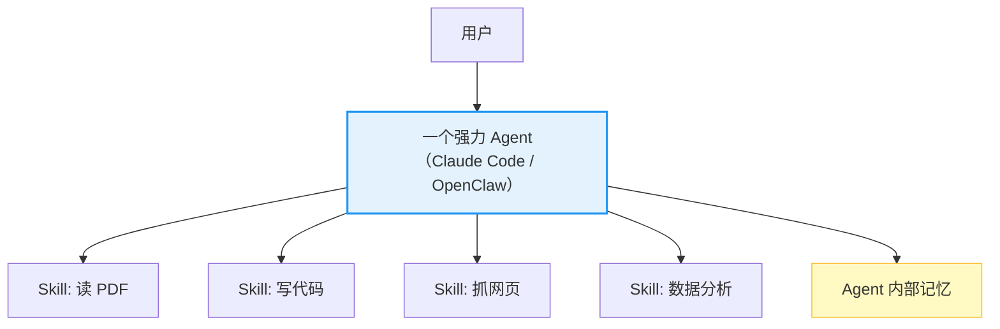
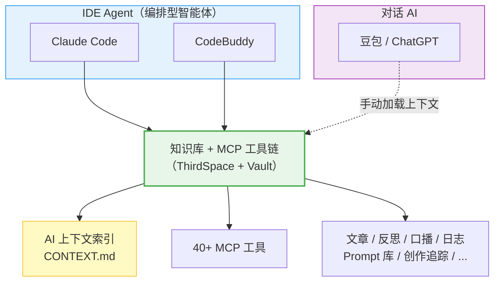
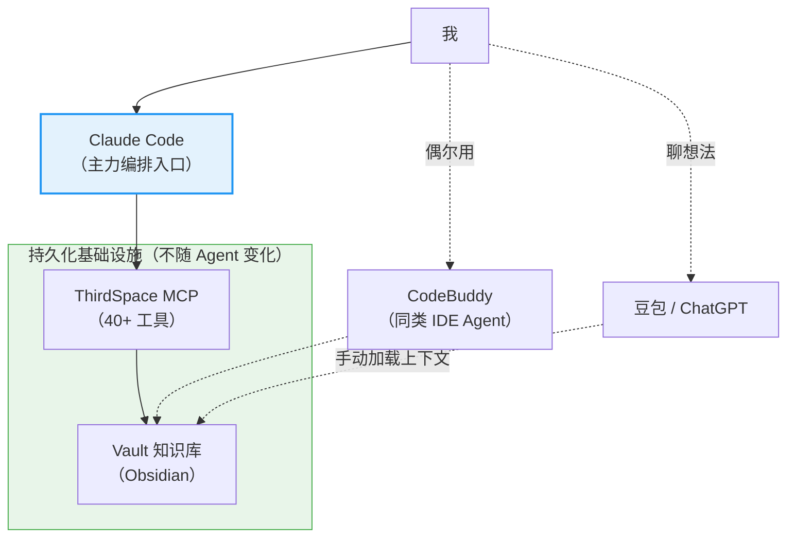
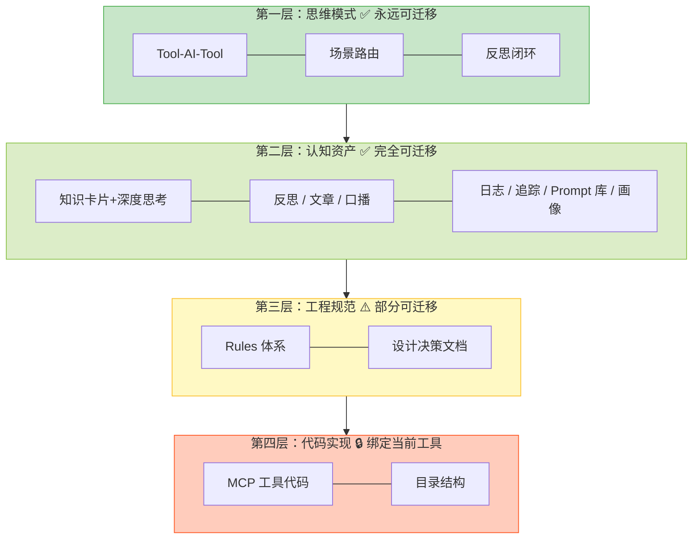

# 知识库中心 vs 智能体中心：一个人的 AI 协作基础设施该怎么建

最近和不少人聊 AI 工作流，发现一个有意思的分歧：大家嘴上都在说「AI 协作」，但打开他们的电脑，干法完全不同。

有人把所有东西都塞进一个 Claude Code 里——记忆、工具、工作流、文件操作、代码生成——一个 Agent 打天下。有人同时开着五六个 AI 工具，这个写代码，那个写文章，另一个做数据分析，然后用一套共享的知识库把它们串起来。

我自己是后者。但我一度以为自己做错了。

直到我想清楚：这不是对错的问题，是两种完全不同的架构选择。而这个选择，会决定你在 AI 这条路上能走多远。

---

## 一、两种模式，两种逻辑

先把两种模式说清楚。

### Agent-Centric：以智能体为中心

这是目前最流行的范式。你有一个强力 Agent（比如 Claude Code），然后把所有能力封装成 Skills 挂在它身上：读 PDF 的 Skill、写 Excel 的 Skill、跑测试的 Skill、抓网页的 Skill。

Agent 是大脑，Skills 是手脚。你只跟一个入口对话，它自己拆解任务、调用工具、验证结果。

OpenClaw 是这种模式的极致体现——你在微信里发一句话，一个 Agent 在你电脑上调用一切。

优势很明显：体验丝滑，一个入口搞定一切，Agent 自己编排，你只管提需求。

### Knowledge-Centric：以知识库为中心

这是我的做法。我不绑定在某一个 Agent 上，而是维护一个中央知识库 + 一套工具链（ThirdSpace MCP），让任何 Agent 来了都能快速「认识我」并干活。

我用 Claude Code 和 CodeBuddy 这类 IDE Agent 写代码（它们内置多种模型，本身就是编排型智能体），偶尔用豆包或 ChatGPT 聊想法、做头脑风暴——它们共享的不是同一个 Agent 大脑，而是同一套知识基础设施。

每个 Agent 来了先读 `CONTEXT.md`，知道我是谁、知识库在哪、该读什么，然后通过 MCP 工具链操作知识库。Agent 是临时工，知识库是持久资产。

---

## 二、核心差异：谁是可替换的？

这两种模式的根本区别，用一句话就能说清：

> **Agent-Centric 里，知识库是 Agent 的附属品。Knowledge-Centric 里，Agent 是知识库的临时工。**

换个角度：如果明天 Claude Code 不能用了，两种模式分别会发生什么？

- Agent-Centric 的人：所有记忆、工作流、Skills 配置都绑在 Claude Code 上，迁移成本巨大。
- Knowledge-Centric 的人：换一个 Agent，让它读 `CONTEXT.md`，五分钟内恢复战斗力。

这不是理论推演。2024 年最佳 Agent 是 GPT-4，2025 年是 Claude 3.5，2026 年是 Claude Opus 4.6。每年都在换代。把所有东西绑在一个 Agent 上，就是把身家押在一匹马上。

读《系统之美》的时候，梅多斯说了一句话让我印象很深：

> 成熟的系统应该降低对单一要素的不可替代性。把系统的力量从"人"身上，转移到"流程"和"结构"上。

套到这里：Agent 是要素，知识库是结构。**成熟的 AI 协作体系，应该降低对任何单一 Agent 的依赖。**

---

## 三、但两种模式不是对立的

说到这你可能觉得我在踩 Agent-Centric。不是。

我日常的主力编排入口就是 Claude Code。我开一个 Claude Code 会话，让它加载 ThirdSpace MCP，然后驱动 MCP 去操作知识库。Claude Code 就是我的编排层。

所以实际上，我的架构长这样：

**Agent-Centric 和 Knowledge-Centric 不是二选一，而是哪层是底座的问题。**

我的底座是知识库 + MCP 工具链。Agent 是可插拔的上层。即使明天 Claude Code 消失了，我的知识库和工具链还在，换一个 Agent 接上去就行。

而纯 Agent-Centric 的人，底座是 Agent 本身。知识和能力都依附于 Agent。Agent 一换，一切重来。

---

## 四、在这个过程中，什么最值得沉淀

运营这套体系一段时间后，我开始思考：如果有一天这些工具全部消失，什么东西是我真正带得走的？

答案分四层：

### 第一层：思维模式（永远可迁移）

这些东西跟任何工具无关，换掉一切它们依然有效：

- **Tool-AI-Tool 设计模式**：工具只做 IO，智能交给 AI。这是一个架构思想，不是一行代码。
- **场景路由思维**：不同任务需要不同上下文。不管底层工具怎么变，这个认知是永恒的。
- **反思-行动闭环**：知识卡片 → 思考问题 → 回答 → 反思 → 行动验证。这是一个个人认知升级的方法论。

这些是 meta 级别的东西——它们是我用来设计系统的思维方式，而不是系统本身。

### 第二层：认知资产（完全可迁移）

纯 Markdown 文件，任何工具都能读。我的知识库里远不止「知识卡片」和「反思」，它是一个完整的个人认知操作系统：

- **知识卡片 + 我亲手回答的深度思考**：卡片有价值，但我的回答才是最有价值的部分——它记录了我在某个时间点对某个问题的真实判断。
- **反思文件（Mirror/Deepen/Bridge）**：我的认知变迁史。几年后回看，这些比任何日志都有价值。
- **文章和口播稿**：我的公开表达记录。每篇文章都是当时认知水平的快照。
- **工作日志**：每天做了什么、想了什么、卡在哪。看似琐碎，但几个月后回看能发现自己的行为模式。
- **创作追踪数据**：抖音/小红书/B 站的真实数据记录 + AI 分析。数据不会骗人，它告诉你什么内容真的有效。
- **Prompt 模板库**：沉淀下来的好用 Prompt，按场景分类。这些是「怎么和 AI 高效协作」的方法论结晶。
- **产品文档和教程**：ThirdSpace、灵犀插件等项目的设计文档。不只是代码文档，更是「为什么这样设计」的决策记录。
- **LifeOS 人际事件和行动追踪**：人际决策的复盘、行动项的跟踪验证。这些是「做人」层面的经验积累。
- **个人画像（profile.md）**：所有 AI 认识我的入口。定期更新，让它始终反映当下的我。

这些内容加在一起，不是一个「笔记本」，而是一个**有结构、有链路、可被 AI 检索和理解的个人认知图谱**。知识卡片通过 source_cards 链接到反思，反思通过 Bridge 生成行动项，行动项通过打卡验证闭环——整个体系是活的。

### 第三层：工程规范（部分可迁移）

Frontmatter 规范、知识卡片格式（严格 3 个思考问题）、Prompt 格式规范……具体格式会随工具变化，但背后的设计决策和理由是可迁移的。每条规范最有价值的部分不是规范本身，而是那句「为什么这样做」。

### 第四层：代码实现（绑定当前工具）

Python 代码、目录结构、topics.json——这些是当前实现的载体，跟着当前架构走就行。

---

## 五、一个被严重低估的动作：记录「为什么」

运营这套体系以来，我做的最有价值的一个习惯，不是写代码，不是配工具，而是**给每个设计决策写一句话的理由**。

比如：

- **为什么知识卡片严格 3 个思考问题？** 精力有限，3 个精准问题 > 5 个泛泛问题。连接层 + 挑战层 + 行动层的递进设计，逼你从理解到质疑到行动。
- **为什么 MCP 工具只做 IO？** 因为 AI 模型在快速迭代，今天的「智能处理」明天可能有更好的方式。IO 是稳定的，智能是流动的。把它们分开，系统就能跟着模型一起进化。
- **为什么 profile.md 分静态区和动态区？** 身份、价值观、写作风格是慢变量，半年变一次。创作数据、最近关注方向是快变量，每周都在变。混在一起，要么自动更新覆盖了你手写的内容，要么手动维护的成本让你放弃更新。
- **为什么场景文件按任务类型组织而不是按工具类型？** 因为工具会变，任务不会。「写文章」这个需求十年后还在，但十年后的工具链一定不是今天的样子。

这些「为什么」看起来不起眼，但它们是你做出好决策的判断力的结晶。代码会过时，工具会迭代，「为什么」不会。

而且这些「为什么」积累到一定量，本身就构成了一个独特的方法论——不是从书上学来的，是从实践中长出来的。这比任何技术教程都稀缺。

---

## 六、给想建自己 AI 基础设施的人的建议

如果你也想建自己的 AI 协作体系，不管用什么工具，有几个原则值得参考：

**1. 知识用工具无关的格式存储。** Markdown 是最好的选择。不要把认知资产锁在某个 APP 的私有格式里。关键是：十年后你还能打开它。

**2. 先有知识库，再选 Agent。** 不要从「我要用 Claude Code」出发，而是从「我的知识应该怎么组织」出发。知识结构确定了，Agent 只是一个调用层。

**3. 给 AI 一个认识你的入口。** 写一份 200 行以内的 CONTEXT.md：你是谁、你的知识库在哪、做什么任务该读什么。任何 AI 读完这个文件，就能在五分钟内进入工作状态。

**4. 沉淀思维模式，而不只是工具用法。** 「我用 Claude Code 配合 MCP 完成了 XX」——这是工具用法，会过时。「我发现把工具限制为纯 IO、让 AI 做所有智能处理，系统的可维护性大幅提升」——这是思维模式，不会过时。

**5. 记录每一个「为什么」。** 这是最容易被忽略、也是最有价值的动作。

---

## 写在最后

那篇 2030 大预言的文章里有一句话：「开始建你自己的知识库。当所有人都用同一个基础模型，你积累的私有数据和结构化经验，是让你的 AI 比别人的 AI 更聪明的唯一方法。」

我同意，但我想补充一句：**不只是知识库，而是你围绕知识库建立的整套基础设施——上下文索引、工具链、工程规范、设计决策记录——这些东西加在一起，才是你真正的 AI 协作护城河。**

模型在换代，Agent 在换代，平台在换代。唯一不换代的，是你积累的认知和你组织这些认知的能力。

而这些，恰恰是 AI 替代不了的。
