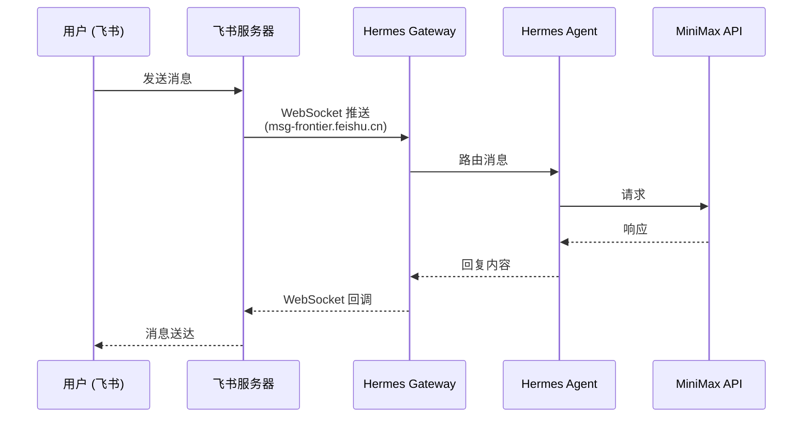
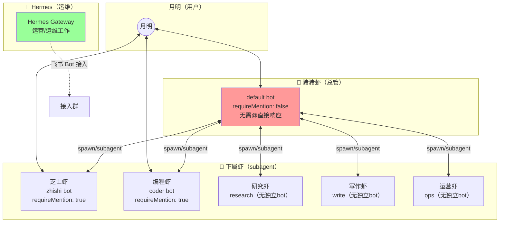

# 飞书 Bot 双向通信安装指南：Hermes Gateway + WebSocket 模式

> 架构图镇楼，先看全貌：



关键点：**本地 Mac 不暴露任何端口**，Hermes 主动连出到 `msg-frontier.feishu.cn`，飞书通过长连接把消息推回来。

### 多 Agent 协作架构图



#### 角色说明

| Agent | 角色定位 | 职责 |
|-------|---------|------|
| 🐷 猪猪虾（总管） | 统筹协调 | 任务分配、进度跟踪、工作日志记录 |
| 🦐 芝士虾 | 知识整理 | 知识整理、写作 |
| 🦐 编程虾 | 代码开发 | 代码开发 |
| 🦐 研究虾 | 技术调研 | 技术调研（无独立 Bot） |
| 🦐 写作虾 | 内容输出 | 内容输出（无独立 Bot） |
| 🦐 运营虾 | 用户运营 | 内容分发、用户运营（无独立 Bot） |
| 🤖 Hermes | 运维 | 飞书 Bot 接入配置、日常运维工作 |

#### 数据流向

- **用户 → 猪猪虾**：直接消息，无需 @
- **猪猪虾 → 下属虾**：spawn subagent，后台运行
- **下属虾结果 → 猪猪虾**：汇总汇报
- **猪猪虾 → 用户**：整理后统一回复

---

## 安装步骤

### 第一步：创建飞书 CLI App

```bash
lark-cli config init --new
```

填写 App 名称，选择「机器人」类型，按提示完成授权。

创建完成后，在 [飞书开放平台](https://open.feishu.cn/app) 找到 App ID 和 App Secret。

### 第二步：配置凭据

在 `~/.hermes/.env` 中写入：

```bash
FEISHU_APP_ID=cli_xxxxxxxxxxxxx
FEISHU_APP_SECRET=xxxxxxxxxxxxxxxxxxxx
FEISHU_DOMAIN=feishu
FEISHU_CONNECTION_MODE=websocket
GATEWAY_ALLOW_ALL_USERS=true
```

### 第三步：安装 lark-oapi（如未安装）

```bash
cd ~/.hermes/hermes-agent
uv pip install lark-oapi --python venv/bin/python
```

验证：
```bash
venv/bin/python -c "import lark_oapi; print('OK')"
```

### 第四步：注册 launchd 自启服务

创建 `~/Library/LaunchAgents/ai.hermes.gateway.plist`：

```xml
<?xml version="1.0" encoding="UTF-8"?>
<!DOCTYPE plist PUBLIC "-//Apple//DTD PLIST 1.0//EN" "http://www.apple.com/DTDs/PropertyList-1.0.dtd">
<plist version="1.0">
<dict>
    <key>Label</key>
    <string>ai.hermes.gateway</string>

    <key>ProgramArguments</key>
    <array>
        <string>/Users/用户名/.hermes/hermes-agent/venv/bin/python</string>
        <string>-m</string>
        <string>hermes_cli.main</string>
        <string>gateway</string>
        <string>run</string>
        <string>--replace</string>
    </array>

    <key>WorkingDirectory</key>
    <string>/Users/用户名/.hermes/hermes-agent</string>

    <key>EnvironmentVariables</key>
    <dict>
        <key>HERMES_HOME</key>
        <string>/Users/用户名/.hermes</string>
    </dict>

    <key>RunAtLoad</key>
    <true/>

    <key>KeepAlive</key>
    <dict>
        <key>SuccessfulExit</key>
        <false/>
    </dict>

    <key>StandardOutPath</key>
    <string>/Users/用户名/.hermes/logs/gateway.log</string>

    <key>StandardErrorPath</key>
    <string>/Users/用户名/.hermes/logs/gateway.error.log</string>
</dict>
</plist>
```

> **说明：** `FEISHU_*` 变量应写入 `~/.hermes/.env`（由 Hermes 自动加载），不要直接写在 plist 里。

### 第五步：加载并验证

```bash
launchctl load ~/Library/LaunchAgents/ai.hermes.gateway.plist
```

检查日志：
```bash
tail -5 ~/.hermes/logs/gateway.log
```

看到这行即成功：
```
[Lark] [INFO] connected to wss://msg-frontier.feishu.cn/ws/v2?...
```

### 第六步：在飞书中找到 Bot，给他发消息

应该能收到回复。

---

## 踩坑总结

| 问题 | 原因 | 解决 |
|------|------|------|
| `lark-oapi not installed` | 装到了系统 Python 而非 Hermes venv | 用 `uv pip install lark-oapi --python ~/.hermes/hermes-agent/venv/bin/python` |
| `lark-oapi` 报错 `No module named` | venv 路径写成 `.venv` 而非 `venv` | 确认 venv 目录名为 `venv`（不是 `.venv`） |
| 飞书连不上 | `.env` 里的变量 launchd 读不到 | 把 `HERMES_HOME` 写进 plist；确认 `~/.hermes/.env` 存在且 FEISHU_* 变量已写入 |
| Gateway 卡住无法交互 | 用了前台模式启动常驻命令 | 永远用 `--replace` 参数或 `nohup ... &` |
| 重启后 Bot 没反应 | launchd 加载失败 | `launchctl load` + 检查 `gateway.error.log` |

---

## 为什么选 WebSocket 而不是 Webhook？

Webhook 模式需要本地暴露一个公网 HTTP 端口接收飞书推送，复杂且不安全。WebSocket 模式下 Hermes 主动连出，无需任何 inbound 端口。苹果电脑在路由器后面也能正常工作。

---

## 多 Agent 飞书群配置

### 架构概述

三虾架构中，每个 Agent 对应一个独立的飞书 Bot 账号（独立的 appId/appSecret），共享同一个飞书群。

**角色分工：**

| Agent | 飞书账号 | 角色 | 响应方式 |
|-------|---------|------|---------|
| 🐷 猪猪虾（default） | default | 总管 | 不用 @，群消息直接响应 |
| 🦐 芝士虾 | zhishi | 知识整理、写作 | 需要 @，被委派任务才响应 |
| 🦐 编程虾 | coder | 代码开发 | 需要 @，被委派任务才响应 |
| 🦐 研究虾 | — | 技术调研 | 无独立 Bot，通过猪猪虾 spawn |
| 🦐 写作虾 | — | 内容输出 | 无独立 Bot，通过猪猪虾 spawn |
| 🦐 运营虾 | — | 内容分发、用户运营 | 无独立 Bot，通过猪猪虾 spawn |
| 🤖 Hermes | — | 运维 | 飞书 Bot 接入配置、日常运维 |

### 配置结构

#### 1. 账号配置（accounts）

每个 Agent 对应一个飞书账号，每个账号独立配置：

```json
"accounts": {
  "default": {
    "appId": "cli_a961c811b8381bc4",
    "appSecret": "...",
    "encryptKey": "zhuzhuxia",
    "verificationToken": "...",
    "groupAllowFrom": ["oc_53d72cec2b0274e163e913b688a27884"],
    "groups": {
      "oc_53d72cec2b0274e163e913b688a27884": {
        "requireMention": false
      }
    }
  },
  "zhishi": { ... },
  "coder": { ... }
}
```

#### 2. 群配置（groups）

```json
"groups": {
  "<群组ID>": {
    "requireMention": true | false
  }
}
```

**关键参数：**

- `groupAllowFrom`：允许 Bot 响应哪些群（群 ID，可配置多个）
- `requireMention`：是否需要 @ 才会回复
  - `requireMention: false` → **总管（猪猪虾）**，群消息无需 @ 直接响应
  - `requireMention: true` → **下属虾**，必须 @ 该 Bot 才会响应

#### 3. 路由绑定（bindings）

agentId 和飞书账号通过 bindings 路由：

```json
"bindings": [
  {
    "type": "route",
    "agentId": "zhishi",
    "match": {
      "channel": "feishu",
      "accountId": "zhishi"
    }
  },
  {
    "type": "route",
    "agentId": "coder",
    "match": {
      "channel": "feishu",
      "accountId": "coder"
    }
  }
]
```

> **default 账号**：无需 binding，Agent `main` 直接使用 default 账号（猪猪虾，总管角色）

### 当前配置示例（从 openclaw.json 提取）

```json
// channels.feishu.accounts
"default": {
  "appId": "cli_a961c811b8381bc4",
  "groupAllowFrom": ["oc_53d72cec2b0274e163e913b688a27884"],
  "groups": {
    "oc_53d72cec2b0274e163e913b688a27884": { "requireMention": false }
  }
}

"zhishi": {
  "appId": "cli_a961370c4ab99bb7",
  "groupAllowFrom": ["oc_53d72cec2b0274e163e913b688a27884"],
  "groups": {
    "oc_53d72cec2b0274e163e913b688a27884": { "requireMention": true }
  }
}

"coder": {
  "appId": "cli_a9612bb10cf89bef",
  "groupAllowFrom": ["oc_53d72cec2b0274e163e913b688a27884"],
  "groups": {
    "oc_53d72cec2b0274e163e913b688a27884": { "requireMention": true }
  }
}
```

### 配置生效条件

修改 `~/.openclaw/openclaw.json` 后，必须重启 Gateway 服务才能生效：

```bash
openclaw gateway restart
```

### 添加新 Agent 到飞书群

1. 在飞书开放平台创建新 Bot，获取新的 appId/appSecret
2. 将新账号写入 `channels.feishu.accounts`
3. 配置 `groupAllowFrom` 允许该 Bot 加入目标群
4. 在 `groups` 中设置 `requireMention: true`
5. 在 `bindings` 中添加路由规则，绑定 `agentId` 到 `accountId`
6. 重启 Gateway：`openclaw gateway restart`
7. 将新 Bot 添加到飞书群中
