# Hermes + Claude Code 三层架构完全落地方案

## Context Engineering 工程化实践 × Trellis 设计借鉴 × 可复用管线沉淀

> 本文档整合 v0.4 / v0.5 所有决策,是当前实施的**唯一参考**,对应仓库 `zzyong24/superAgent`。

---

## 一、背景与核心问题

### 1.1 原始架构

```
用户 → Hermes(常驻主 Agent)→ Claude Code(feature 级独立 session)
```

- **Hermes**:常驻 Agent,理解用户目标、拆解任务、判断质量、决定重试
- **Claude Code**:专注执行,基于结构化契约产出代码 / 内容

### 1.2 十个必须解决的问题

| # | 问题 | 本方案的应对 |
|---|---|---|
| 1 | Generator-Evaluator 分离没有结构化契约 | `sprint_contract.json` + `acceptance` 清单 |
| 2 | feature_list 跨 session 丢失 | `.harness/feature_list.json` 作为 Source of Truth |
| 3 | Claude Code 越权充当 Planner | `spec/AGENTS.md` 禁止项 + hook 硬拦 |
| 4 | Claude Code 长任务 Context 膨胀 | feature 级独立 session + feature Reset |
| 5 | Hermes 自己也会 Context Overload | 进程内 Reset + `pending_eval` 防丢 |
| 6 | Harness Engineering 没工程化 | skill 化,仓库即约束 |
| 7 | 工具选型隐性、不可复用 | `phase=0 tooling` 独立阶段 |
| 8 | 每次任务重做一遍 | 管线(pipeline)=成功 sprint 的抽象物 |
| 9 | 人类介入密度无法控制 | gate / review / notify 三类 checkpoint |
| 10 | 熟悉管线后仍然频繁打扰 | YOLO 模式(stats 驱动) |

### 1.3 核心目标

- **任何任务都遵循这套规范**,不依赖临场决策
- **工程化文件夹 = 可复用的步骤 = 超级 skill**
- **人类始终掌舵**,AI Agent 在各自职责范围内工作
- **成功经验可沉淀**,第 4 次做同类任务基本自动化

---

## 二、三层架构总图

### 2.1 角色映射

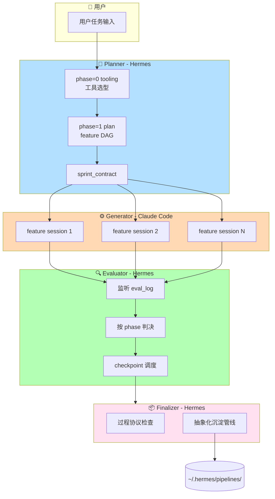

### 2.2 完整数据流

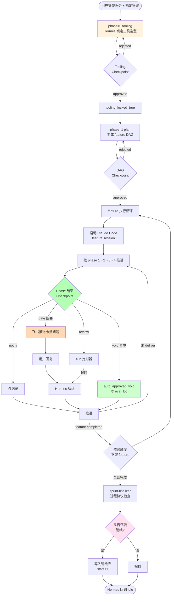

### 2.3 八层联动

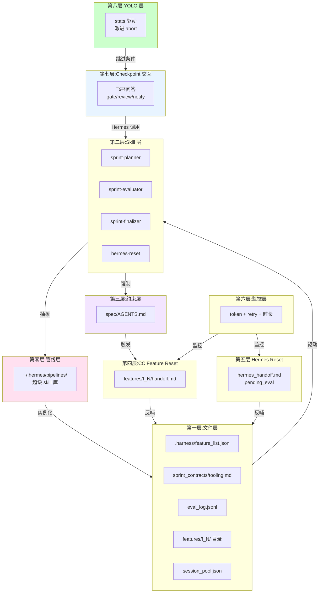

---

## 三、核心设计决策(十大)

| # | 决策 | 替代方案 | 选择理由 |
|---|---|---|---|
| 1 | phase=0 tooling 独立阶段 | 在 phase=1 里顺便选型 | 显式化隐性工具资产,避免跨 feature 选型漂移 |
| 2 | Checkpoint 问答形态(不发链接) | Web 面板 / 飞书审批卡 | 成本低、强迫 Hermes 先看产物再提问、手机端可响应 |
| 3 | YOLO 激进 abort | 保守(只 abort 未来) | 一旦管线不可信,历史 auto_approved 的假设已破坏,必须重审 |
| 4 | Stats 继承(semver 规则) | 每版本独立 stats | 小版本演进不应重置信任;major 才重置 |
| 5 | 干完再抽象(过程协议留痕) | 实时沉淀 | 实时沉淀打断太多;事后抽象能看全局 |
| 6 | feature 级独立 session | sprint 级单 session | 支持 waiting_human 时并行;降低单 session context 压力 |
| 7 | Hermes 常驻 + 进程内 Reset | 每次新会话启动 | 事件响应基础;Reset 时只清上下文不杀进程 |
| 8 | 单 sprint 独占 | 允许并行队列 | 并行是幻觉;拒绝明确比队列友好 |
| 9 | 用户手选管线 | 自动匹配 | 主动权在用户;无需匹配算法 |
| 10 | waiting_human 时推进无冲突 feature | 全局暂停 | 不浪费 Claude Code 带宽 |

---

## 四、Phase Workflow(0-4 完整定义)

### 4.1 五个 Phase

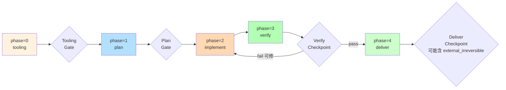

### 4.2 Phase 执行表

| Phase | Scope | 执行者 | 完成标志 |
|-------|-------|--------|---------|
| 0 tooling | sprint | **Hermes** | `tooling.md` 产出 + gate approved → `tooling_locked=true` |
| 1 plan | feature | Claude Code | `feature.children` 拆好 + plan checkpoint 通过 |
| 2 implement | feature | Claude Code | 代码/内容编写完 + 产物齐全 |
| 3 verify | feature | Claude Code | 测试通过 + acceptance 自检通过 |
| 4 deliver | feature | Claude Code | git commit + `status=completed` |

**硬性约束**:`tooling_locked=false` 时,任何 feature 禁止进入 phase=2。

### 4.3 Phase 切换决策表

| 当前 phase | Evaluator 结果 | 下一步 |
|---|---|---|
| 1 plan | pass | → phase=2 |
| 1 plan | retry / rejected | ⟲ phase=1 |
| 2 implement | pass | → phase=3 |
| 2 implement | retry | ⟲ phase=2 |
| 3 verify | pass | → phase=4 |
| 3 verify | retry | ⟲ **phase=2**(不是 phase=3) |
| 3 verify | fail | ↑ 升级 Hermes,可能 replan |
| 4 deliver | pass | feature completed |

---

## 五、Generator-Evaluator 迭代循环

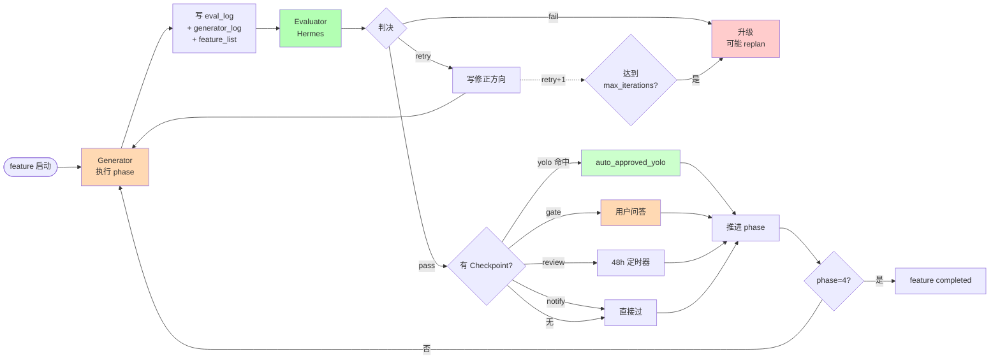

---

## 六、Checkpoint 三类型机制(v0.5 核心新增)

### 6.1 三类型对照

| 类型 | 场景 | 交互 | 超时 |
|---|---|---|---|
| **gate** 🚦 | 关键决策(大纲、成品、发布前) | 必须回复 | 永不超时,24h/72h 催办 |
| **review** 🔍 | 完整性检查(调研、Mac 文字稿) | 建议回复 | 48h 默认通过 |
| **notify** 📢 | 完成通知(飞书发布成功) | 可看可不看 | 立即放行 |

### 6.2 Gate Checkpoint 完整流程

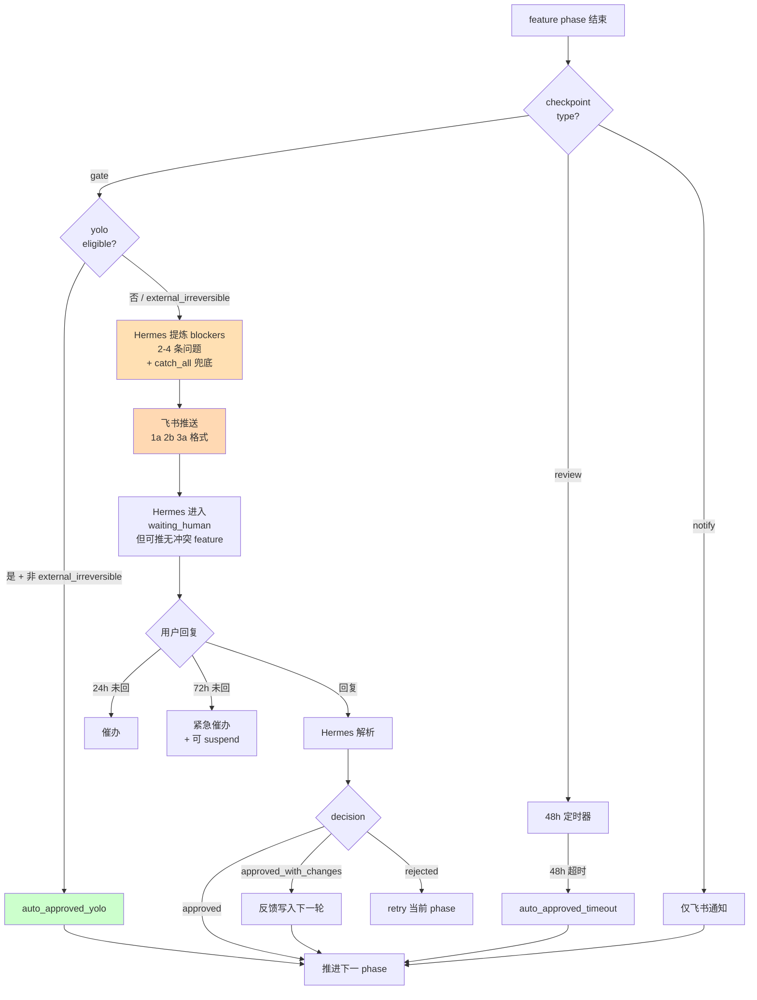

### 6.3 Blocker 提炼示例

```
【Checkpoint】f006 HTML PPT 成品

我做完了 18 页 PPT,有 3 个地方要你确认:

1. Windows 章节用文字+官方截图 OK 吗?
   a. OK  b. 找人代录  c. 去掉

2. 配音按页分段还是按章节?
   a. 按页  b. 按章节

3. 还有其他你觉得不对的地方吗?(catch_all 兜底)
   a. 没有  b. 有(请详述)

请回复编号+选项,如 "1a 2b 3a"。
```

**兜底规则**:每个 gate 必含 catch_all,防止 Hermes 提炼盲区。

---

## 七、YOLO 模式(自动推进 + 激进退出)

### 7.1 进入 / 退出状态机

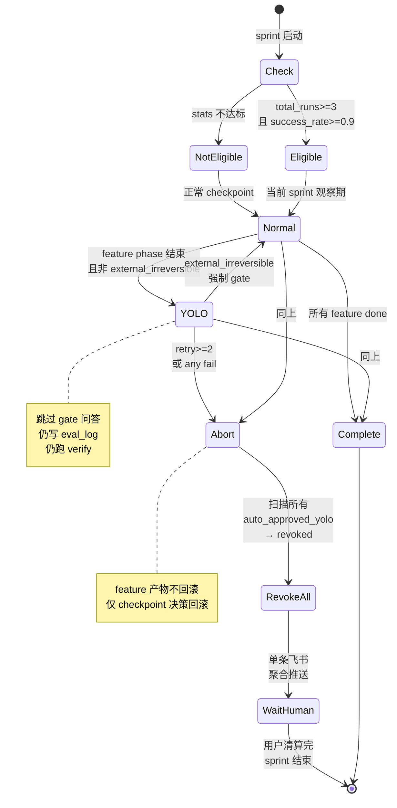

### 7.2 YOLO 跳过 / 不跳过

| 可跳 | 不可跳 |
|---|---|
| ✅ gate checkpoint 问答 | ❌ eval_log 写入 |
| ✅ review checkpoint | ❌ phase 基本校验 |
| ✅ notify 本来就不阻塞 | ❌ Reset 机制 |
| | ❌ fail 状态升级 |
| | ❌ **external_irreversible**(push/发布/部署) |

### 7.3 Abort 聚合推送示例

```
【YOLO 已退出,请回来审】

原因:f007 配音 API 连续失败

以下 3 个 checkpoint 已被 revoke 回 pending,需要你补审:

======== 1. cp-f002-1 - PPT 大纲 ========
(原 blocker 问题组)

======== 2. cp-f006-1 - HTML PPT 成品 ========
(原 blocker 问题组)

======== 3. cp-f007-1 - 配音 ========
(原 blocker 问题组)

请按顺序回复,每个 checkpoint 用 "cp1: 1a 2b" 格式。
```

**激进策略的关键点**:
- checkpoint 决策回滚,**feature 产物不回滚**
- 若用户回头审 f002 发现不对 → 触发 replan,不物理撤销 f006
- 单条消息聚合,不允许刷屏

---

## 八、Sprint 生命周期

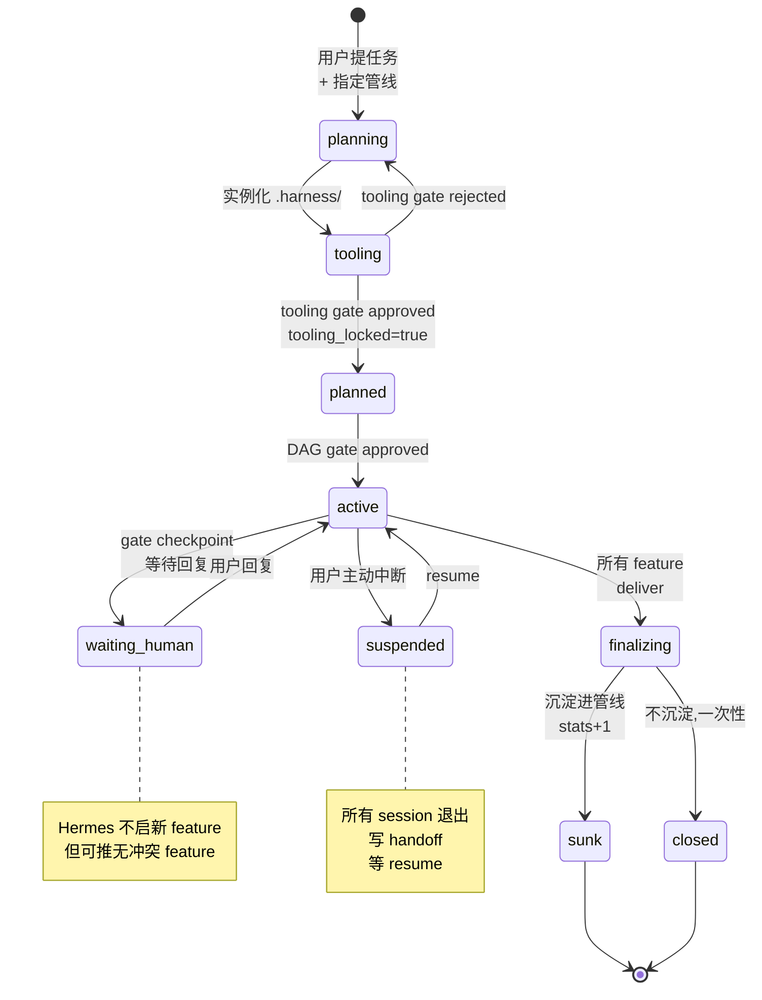

---

## 九、双 Reset 机制(feature 级 + 进程内)

### 9.1 两种 Reset 对比

| 维度 | Claude Code Feature Reset | Hermes 进程内 Reset |
|---|---|---|
| 粒度 | 单 feature | 整个 Hermes 上下文 |
| 谁触发 | Generator 自感 / Hermes 监听 | Hermes 自己 |
| 谁执行 | Generator 写 handoff 后退出 | Hermes 清空上下文重读文件 |
| 新启动 | Hermes 启动同 feature 新 session | 同进程,不杀 |
| 关键文件 | `features/f_N/handoff.md` | `hermes_handoff.md` + `pending_eval` |
| 触发阈值 | token>70% / retry>=2 / >2h | token>70% / 3 sprint retry / >3h |

### 9.2 Feature Reset 流程

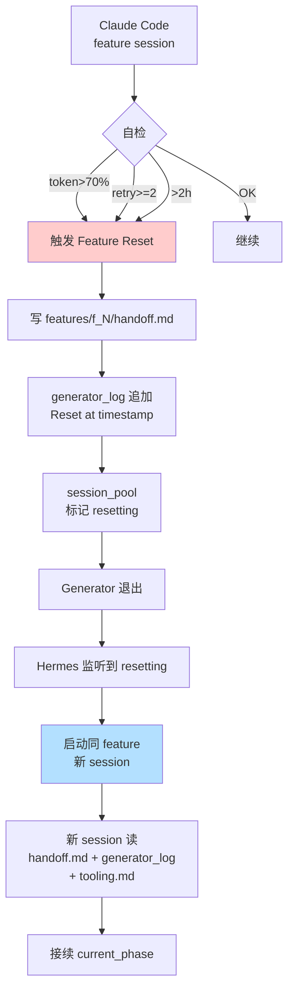

### 9.3 Hermes Reset 流程(核心防护:pending_eval)

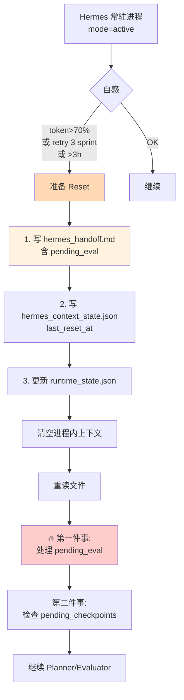

**落盘顺序铁律**:`handoff → context_state → runtime_state`,颠倒就丢数据。

### 9.4 pending_eval:最危险的防护

**场景**:Hermes 判了 retry 但没来得及写 eval_log 就触达阈值。

`hermes_context_state.json` 里的 `pending_eval` 字段:

```json
{
  "feature_id": "f003",
  "reason": "上下文满之前未完成评价",
  "eval_decision": "retry",
  "fix_direction": "补充 mock 数据后重新运行 verify phase"
}
```

新 Hermes 启动后**第一件事**就是处理它:写入 eval_log → 触发 retry → 清空字段。

---

## 十、管线(Pipeline)= 超级 Skill

### 10.1 管线是什么

**pipeline = 成功 sprint 的抽象物 = 可复用的超级 skill**

第一次跑任务 → 过程协议留全 → sprint-finalizer 抽象 → 写入 `~/.hermes/pipelines/<id>/`。

### 10.2 管线闭环

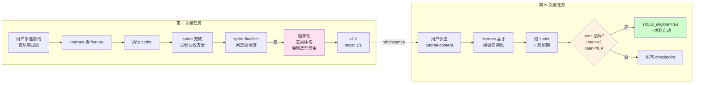

### 10.3 Stats 继承规则(semver)

| 改动类型 | 版本号 | 继承 stats |
|---|---|---|
| 微调 checkpoint prompt 文案 | patch(1.2.1 → 1.2.2) | ✅ |
| 新增 / 修改 policy | minor(1.2 → 1.3) | ✅ |
| 改动 feature DAG 结构 | major(1.x → 2.0) | ❌ 重置 |

**安全阀**:即使 `total_runs` 大,若 `current_version_runs` 连续 2 次失败,**不进入 YOLO**。

### 10.4 管线目录结构

```
~/.hermes/pipelines/
├── registry.json
├── tutorial-content/
│   ├── pipeline.yaml                # 元信息 + stats + version_history
│   ├── feature_template.json        # feature DAG 模板
│   ├── tooling_template.md          # phase=0 模板
│   ├── checkpoint_policy.yaml       # checkpoint 分布策略
│   └── runs/                        # 软链历史 .harness/
└── code-feature/
```

---

## 十一、文件层(`.harness/` 完整结构)

```
~/Workbase/pipeline/sprint_20260421_1/
├── schemas/                         # 从 skill 复制,只读
├── templates/                       # 从 skill 复制,只读
├── spec/                            # 从 skill 复制,只读
├── protocols/                       # 从 skill 复制,只读
└── .harness/                        # 运行时
    ├── runtime_state.json           # Hermes 进程状态
    ├── feature_list.json            # Source of Truth
    ├── session_pool.json            # CC session 池,max_concurrent=2
    ├── eval_log.jsonl               # append-only
    ├── hermes_handoff.md            # Reset 中断快照
    ├── hermes_context_state.json    # 含 pending_eval
    ├── claude_code_context_state.json
    ├── .current_agent
    ├── logs/
    │   └── hook.log                 # Hook 动作日志
    ├── sprint_contracts/
    │   └── sprint_20260421_1/
    │       ├── contract.json
    │       └── tooling.md           # phase=0 产物
    └── features/                    # feature 级隔离
        ├── f001/
        │   ├── session_id.txt
        │   ├── context_snapshot.md  # 启动时初始 prompt
        │   ├── generator_log.md     # 每 phase 追加
        │   ├── handoff.md           # Reset 时写
        │   ├── AGENTS.md            # 从 spec 复制
        │   └── .claude/             # CC hook 配置
        │       ├── settings.json
        │       └── hooks/
        │           ├── session-start.sh
        │           ├── pre-edit-guard.sh
        │           ├── pre-bash-guard.sh
        │           └── stop-guard.sh
        └── f002/
            └── ...
```

---

## 十二、硬约束:Claude Code Hook(P0 级)

**软约束(AGENTS.md 文字禁止)不够**。必须用 Claude Code 的 hook 机制做**harness 级硬拦截**。

### 12.1 四个 P0 Hook

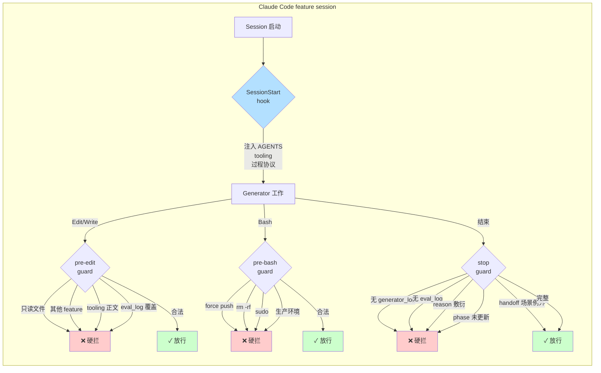

### 12.2 Hook 覆盖清单

| AGENTS.md 禁止项 | Hook 覆盖 |
|---|---|
| 修改 schemas / templates / spec / protocols | ✅ pre-edit-guard |
| 操作其他 feature 目录 | ✅ pre-edit-guard |
| 修改 tooling.md 正文 | ✅ pre-edit-guard(只允许 append 运行时新增)|
| eval_log 整体覆盖 | ✅ pre-edit-guard |
| generator_log 整体覆盖 | ✅ pre-edit-guard |
| git push --force / amend / add -A | ✅ pre-bash-guard |
| sudo / rm -rf | ✅ pre-bash-guard |
| 未写过程协议就结束 | ✅ stop-guard |
| eval_log reason 敷衍("ok"、"pass") | ✅ stop-guard(敷衍词黑名单 + 长度 ≥ 20) |
| feature_list phase 未更新 | ✅ stop-guard |
| 启动没读 AGENTS + tooling | ✅ session-start(直接注入) |

### 12.3 例外机制

- **Reset 场景**:`handoff.md` 最近 5 分钟内写入 + > 50 字节 → Stop 放行
- **tooling 运行时新增**:Edit `old_string` 必须在 "## 6. 运行时新增" 行号之后
- **Bash append 到 tooling**:允许 `echo '...' >> tooling.md`(只验证追加位置)

---

## 十三、过程协议(Process Protocol)

### 13.1 为什么要过程协议

**决策 5 引申**:干完再抽象的前提是**干的时候留足够结构化的记录**。

### 13.2 必须落盘产物清单

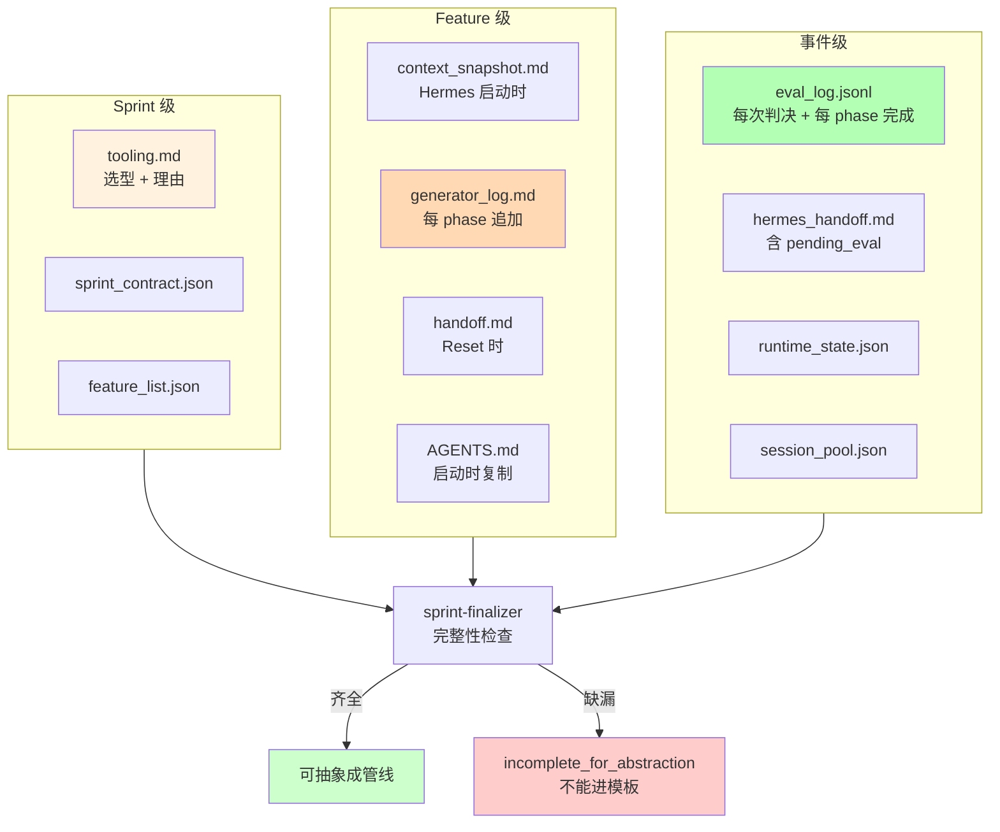

### 13.3 三个关键字段要求

1. **tooling.md 必含"选型理由"**
 - ❌ `PPT 工具:reveal.js`
 - ✅ `PPT 工具:reveal.js(不选 marp,因交互性更强,教学场景需要)`

2. **generator_log 每 phase 必含"关键决策"小节**
 - 即使没特殊决策也要写"按常规实现,无特殊决策"

3. **eval_log 必含 reason**
 - ❌ `"ok"` / `"看起来不错"` / 空串
 - ✅ `"3 个 acceptance 全 pass,测试覆盖率 92%"`
 - Stop hook 自动拦截长度 < 20 或敷衍词

---

## 十四、Session 并发模型

### 14.1 max_concurrent = 2 的并行模型

```mermaid
gantt
    title Sprint 时间线:多 feature 并行 + waiting_human
    dateFormat HH:mm
    axisFormat %H:%M

    section f001 视频调研
    执行 phase 1-4     :active, f1, 00:00, 60m

    section f002 PPT 大纲
    依赖 f001 等待     :crit, 00:00, 60m
    执行 phase 1       :active, f2p1, after f1, 30m
    gate:你审大纲     :milestone, f2m, after f2p1, 0m
    waiting_human     :crit, f2wait, after f2m, 45m
    执行 phase 2-4     :active, f2rest, after f2wait, 90m

    section f003 Linux 截图
    依赖 f001 等待     :crit, 00:00, 60m
    执行(不依赖 f002) :active, f3, after f1, 120m

    section f006 HTML PPT
    依赖 f002 等待     :crit, 00:00, 180m
    执行 + gate       :active, f6, 04:15, 60m
```

**关键**:`waiting_human` 时,不依赖 waiting feature 的其他 feature **可以并行启动**。上图 f002 等用户审大纲时,f003 Linux 截图继续跑。

### 14.2 启动策略

```
feature 可以启动 iff:
  1. feature.depends_on 全部 completed
  2. 当前 active session 数 < max_concurrent (2)
  3. tooling_locked = true
  4. feature.status = pending
  5. 没有全局 suspend
```

---

## 十五、实施路线图

### 阶段一:文件层 + 协议 schema(已完成)
- ✅ 7 个 JSON/YAML schema
- ✅ 6 个 Markdown 模板
- ✅ `superAgent/` 仓库目录结构

### 阶段二:Hermes 常驻 + 核心 skill(已完成)
- ✅ SKILL.md 入口
- ✅ sprint-planner(含 phase=0)
- ✅ sprint-evaluator(含 checkpoint 问答)
- ✅ sprint-finalizer
- ✅ hermes-reset

### 阶段三:Claude Code feature 级隔离(已完成)
- ✅ spec/AGENTS.md v0.5
- ✅ feature_session_init 模板
- ✅ session_pool 管理协议

### 阶段四:Checkpoint 交互 + 飞书(已完成)
- ✅ 飞书推送模板
- ✅ gate/review/notify 三类型处理
- ✅ 用户回复解析规则

### 阶段五:Reset 机制(已完成)
- ✅ feature 级 CC Reset 协议
- ✅ 进程内 Hermes Reset 协议

### 阶段六:管线沉淀 + YOLO(已完成)
- ✅ pipeline.schema.yaml
- ✅ stats 继承规则
- ✅ YOLO 激进 abort 协议

### 阶段七:Hook 硬约束(已完成)
- ✅ session-start.sh
- ✅ pre-edit-guard.sh
- ✅ pre-bash-guard.sh
- ✅ stop-guard.sh

### 阶段八:端到端验证(待做)
- [ ] 真实跑一个极简任务验证 STEP 1 初始化 + hook 不误伤
- [ ] 沉淀第一条 pipeline
- [ ] 再跑 2 次验证 YOLO 进入
- [ ] 故意触发 abort 验证 revoke

---

## 十六、关键设计决策的深度理由

### 16.1 为什么 phase=0 必须独立
Hermes 的 skill 和 MCP 工具是"隐性资产",Claude Code 不知道。phase=0 把这些**显式化**成 tooling.md,避免:
- Generator 重复造轮子
- 跨 feature 选型不一致
- Planner 规划不切实际的能力

### 16.2 为什么 Checkpoint 是问答而非链接
- 链接方案要求起 Web 服务、localhost 穿透、手机打不开
- 问答形态成本低,但要求 Hermes 会"提炼卡点"
- **这反而是好事**:强迫 Hermes 自己先看一遍产物,而不是把问题甩给你

### 16.3 为什么 YOLO Abort 激进
一旦管线在本次 sprint 暴露"不再可信"的信号:
- 历史的 auto_approved_yolo 本质上是基于"管线可信"假设做的
- 假设被打破,决策必须重审
- 但 **feature 产物不回滚**,只回滚 checkpoint 决策

### 16.4 为什么干完再抽象
- 实时沉淀会频繁打断 → 噪音大
- 事后抽象能看**全局成败** → 判断更准
- "留过程协议"是强约束 → 保证事后有料可抽

### 16.5 为什么 Hermes 常驻 + 无状态
- 常驻是**事件响应**的基础(飞书回调、文件变化、超时定时器)
- 无状态是 **Reset 便宜**的基础——只需清空上下文重读文件
- 组合起来:**进程几乎不占推理成本,只在被唤醒时工作**

### 16.6 为什么单 sprint 独占
- "并发感"是幻觉,Hermes 一次只能真干一件
- 队列会让你忘记排了什么
- 让 Hermes 拒绝得明确 → 你自己决定等还是中断

---

## 十七、风险与应对

| 风险 | 应对 |
|---|---|
| Claude Code 跳 phase | AGENTS.md 禁止 + stop-guard hook 拦 + Evaluator 发现即 fail |
| Hermes Reset 丢 pending_eval | 落盘顺序固定:handoff → context_state → runtime_state |
| acceptance 不精确 | phase=0 + spec/guides/acceptance-writing.md 规范 |
| tooling 运行时漂移 | Generator 新增依赖必须写回 tooling.md 运行时章节,pre-edit-guard 硬约束 |
| Hermes 提炼 blocker 不全 | 每个 checkpoint 必含 catch_all 兜底问 |
| YOLO 误通过 | stats 双份(total + current_version),current 连续失败告警 |
| 管线版本误判 | version 规则明确,major 变更需人工确认 |
| 用户回复歧义 | Hermes 追问一次而非猜测 |
| session_pool 并发冲突 | max_concurrent=2 + start_when_dependency_ready 策略 |
| 软约束不够 | 4 个 P0 hook 做硬拦截 |
| hook 误伤合法操作 | 规则白名单 + 例外机制 + hook.log 审计 |

---

## 十八、与原始概念对照

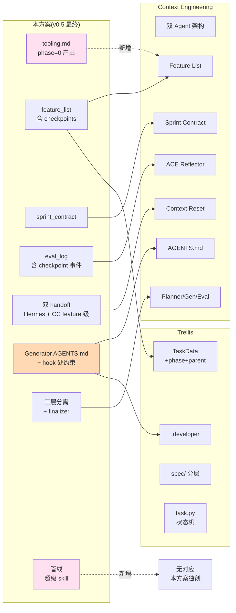

---

## 十九、产物清单

### 19.1 superAgent 仓库(36 文件)

```
superAgent/
├── README.md                    # 项目说明
├── SKILL.md                     # Hermes 入口(179 行严格指令)
├── hooks/ (6)                   # P0 硬约束 hook
│   ├── session-start.sh
│   ├── pre-edit-guard.sh
│   ├── pre-bash-guard.sh
│   ├── stop-guard.sh
│   ├── settings.json.template
│   └── README.md
├── schemas/ (7)                 # JSON/YAML schema
│   ├── runtime_state.schema.json
│   ├── feature_list.schema.json
│   ├── sprint_contract.schema.json
│   ├── session_pool.schema.json
│   ├── eval_log.schema.json
│   ├── pipeline.schema.yaml
│   └── checkpoint.schema.json
├── templates/ (6)               # Markdown 模板
│   ├── tooling.template.md
│   ├── hermes_handoff.template.md
│   ├── claude_code_handoff.template.md
│   ├── feature_session_init.template.md
│   ├── generator_log.template.md
│   └── checkpoint_notify.template.md
├── spec/ (6)                    # Generator 约束
│   ├── AGENTS.md                # 主约束(必读)
│   ├── index.md
│   ├── project.md
│   └── guides/
│       ├── phase-workflow.md
│       ├── acceptance-writing.md
│       └── cross-layer.md
├── sub-skills/ (4)              # Hermes 分阶段 skill
│   ├── sprint-planner.md
│   ├── sprint-evaluator.md
│   ├── sprint-finalizer.md
│   └── hermes-reset.md
└── protocols/ (5)               # 跨 Agent 协作协议
    ├── checkpoint-qa.md
    ├── yolo.md
    ├── feature-isolation.md
    ├── reset-mechanism.md
    └── process-protocol.md
```

### 19.2 架构文档索引

- **本文档**:架构完全落地方案(v0.5 整合版)
- **代码仓库**:https://github.com/zzyong24/superAgent
- **工作日志**:`vault/space/crafted/work/worklog/2026/04/2026-04-21-周二.md`

---

## 二十、哲学

> **工程化文件夹 = 可复用的步骤 = 超级 skill**

第一次跑一个任务会累,但过程协议留好、管线沉淀下来之后,**第 4 次基本自动化**。

**人工投入一次,换长期稳定自动化**,而不是追求一次性全自动。

这套架构的核心不是"让 AI 更强",是**让人类和 AI 的协作契约显式化、工程化、可沉淀**。

---

*文档版本:v0.6(v0.4 + v0.5 整合版,含 hook 硬约束)*
*创建日期:2026-04-21*
*对应代码:github.com/zzyong24/superAgent commit ab92af0*
*下一步:阶段八端到端验证,跑一个极简任务沉淀第一条管线*
