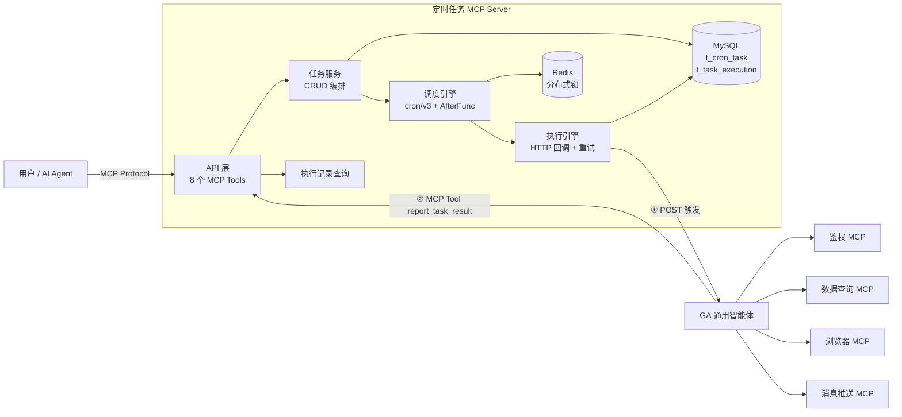
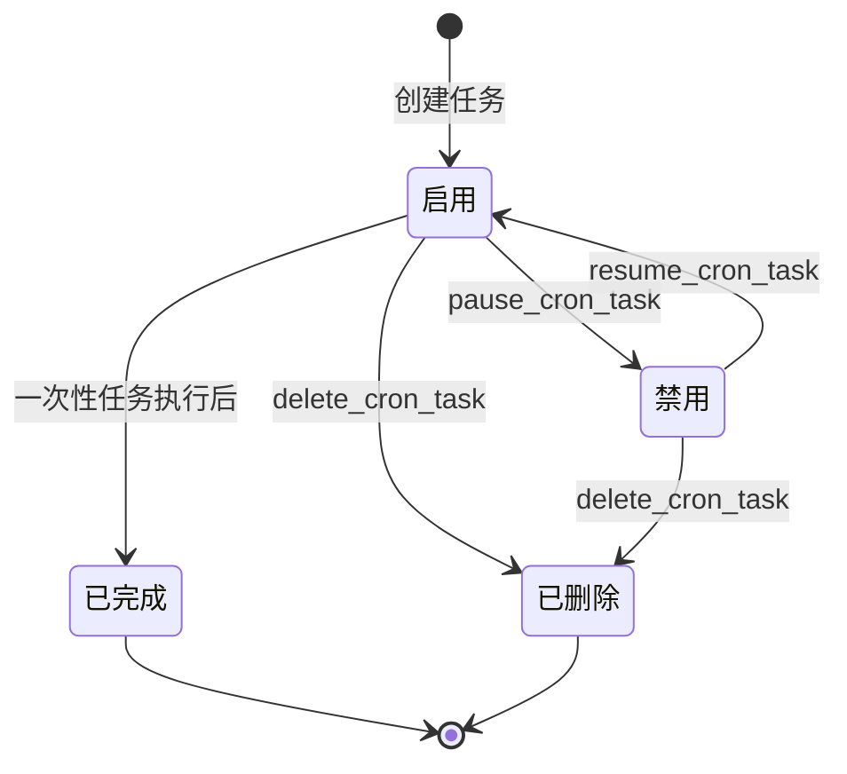
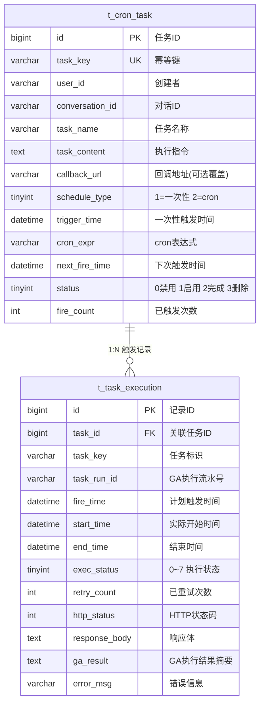
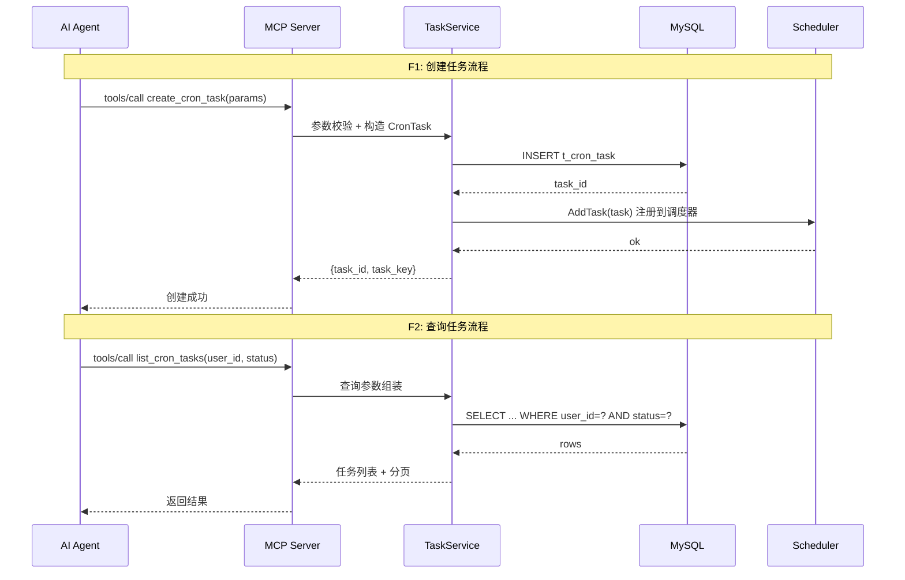
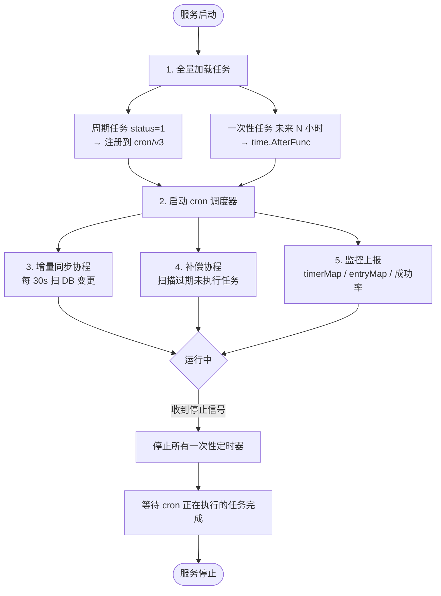
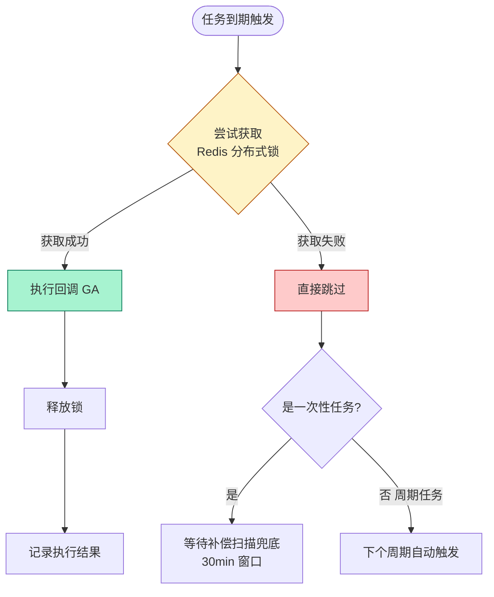
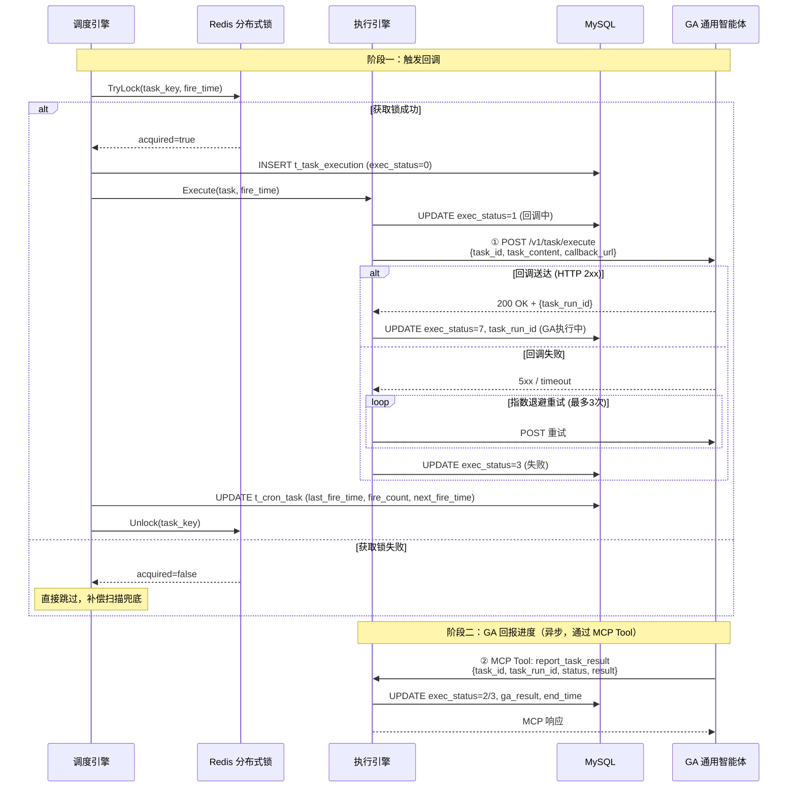

# 定时任务 MCP 服务 — 技术改造文档

## 一、现状与目标

### 1.1 系统架构总览



定时任务 MCP 作为系统的"闹钟"模块，负责触发回调 GA 并**追踪 GA 的执行结果**。GA 收到触发后，需在执行完成/失败时通过 MCP Tool `report_task_result` 回报进度。GA 收到触发指令后如何执行（走 Skill 还是 MCP 逐个调用），属于 GA 侧的设计，不在本服务职责范围内。

**核心规则**：所有 MCP 模块只与 GA 通信，模块之间不直接交互。GA 是唯一的调度中枢。

**双向通信协议**：
- **触发方向**（定时任务 → GA）：HTTP POST，因为 MCP 是 Client→Server 协议，Server 无法主动推 Client
- **回报方向**（GA → 定时任务）：MCP Tool，GA 本身就是 MCP Client，复用同一连接零成本

### 1.2 当前缺失

| 维度 | 现状 | 目标 |
|------|------|------|
| 定时调度 | 无独立定时任务服务 | 提供完整的任务 CRUD + 自动调度能力 |
| 任务触发 | 人工触发或依赖外部 cron | 到期自动 POST 回调智能体固定接口 |
| 执行记录 | 无 | 每次触发自动记录状态、耗时、响应；GA 回报最终执行结果 |
| MCP 入口 | 无 | AI Agent 通过 MCP 协议管理定时任务 |

---

## 二、需求定义

### 2.1 调度类型

| schedule_type | 名称 | 说明 | 典型场景 |
|:---:|------|------|---------|
| 1 | **一次性任务** | 指定触发时间，执行一次后自动标记完成 | "明天上午 10 点提醒我开会" |
| 2 | **cron 周期任务** | cron 表达式，周期性反复执行 | "每天早上 9 点查 DNFM 的 CPA 数据" |

### 2.2 任务状态

| 状态值 | 含义 | 流转条件 |
|:---:|------|---------|
| 0 | 禁用 | 用户主动暂停 |
| 1 | 启用 | 创建时默认 / 恢复后 |
| 2 | 已完成 | 一次性任务执行后自动标记 |
| 3 | 已删除 | 软删除 |



### 2.3 关键设计决策

#### `task_content` 是完整的执行指令，不是备注

每次触发本质上是一个**全新对话**。`conversation_id` 仅作关联标记，GA 不一定能恢复历史上下文。因此：

- `task_content` 必须是**自包含的执行指令**，包含所有执行所需的参数
- 不能依赖 GA "记住"创建时的对话上下文
- 建议格式：自然语言描述 + 结构化参数 JSON

```
示例 task_content:
"查询 DNFM 过去7天 CPA 数据，CPA>100 则截图推送到企微群。
参数：game=DNFM, metric=CPA, threshold=100, rts_name=josetian, push_target=wecom_grp_xxx"
```

> **`rts_name` 和 `push_target` 应编码进 `task_content`**：虽然回调 JSON 已包含 `user_id`，但 GA 执行时需要知道用谁的身份鉴权（`rts_name`）和结果推给谁（`push_target`），这两个信息建议同时写在 `task_content` 中，双重保障。

#### 回调 JSON 携带 `user_id`，解决"给谁做"的路由问题

回调请求体包含 `user_id`（来自 `t_cron_task.user_id`），GA 可据此：

1. **鉴权路由**：用 `user_id` 对应的 `rts_name` 调用数据查询 MCP
2. **推送路由**：根据 `user_id` 查找默认推送渠道（企微群/邮件）
3. **多 Agent 扩展**：未来如有多 GA 实例，可按 `user_id` 路由到对应 Agent（当前预留，不阻塞）

**当前策略**：单一 GA 实例 + `user_id` 透传。`t_cron_task` 预留可选 `callback_url` 字段扩展位，特殊任务可覆盖默认回调地址。

---

## 三、数据库设计

### 3.1 任务表 `t_cron_task`

```sql
CREATE TABLE `t_cron_task` (
    `id`              BIGINT UNSIGNED NOT NULL AUTO_INCREMENT COMMENT '任务ID',
    `task_key`        VARCHAR(128) NOT NULL COMMENT '任务唯一标识(幂等键)',
    `user_id`         VARCHAR(64) NOT NULL COMMENT '创建者用户ID',
    `conversation_id` VARCHAR(128) NOT NULL COMMENT '所属对话ID，触发时回传给智能体（仅作关联标记）',
    `task_name`       VARCHAR(256) NOT NULL COMMENT '任务名称',
    `task_desc`       VARCHAR(1024) DEFAULT '' COMMENT '任务描述',
    `task_content`    TEXT NOT NULL COMMENT '完整执行指令，触发时原样回传给智能体',

    -- 调度配置
    `schedule_type`   TINYINT NOT NULL DEFAULT 1 COMMENT '调度类型: 1=一次性 2=cron周期',
    `trigger_time`    DATETIME DEFAULT NULL COMMENT '一次性任务触发时间',
    `cron_expr`       VARCHAR(128) DEFAULT '' COMMENT 'cron表达式(周期任务)',
    `next_fire_time`  DATETIME DEFAULT NULL COMMENT '下次触发时间(调度引擎计算)',

    -- 回调配置
    `callback_url`    VARCHAR(512) DEFAULT '' COMMENT '回调地址(为空则用全局配置,支持特殊任务覆盖)',

    -- 重试配置
    `max_retry`       INT DEFAULT 3 COMMENT '最大重试次数',
    `retry_interval`  INT DEFAULT 5000 COMMENT '重试间隔(毫秒)',

    -- 状态
    `status`          TINYINT NOT NULL DEFAULT 1 COMMENT '状态: 0=禁用 1=启用 2=已完成 3=已删除',
    `last_fire_time`  DATETIME DEFAULT NULL COMMENT '上次触发时间',
    `fire_count`      INT DEFAULT 0 COMMENT '已触发次数',

    -- 审计
    `created_at`      DATETIME NOT NULL DEFAULT CURRENT_TIMESTAMP,
    `updated_at`      DATETIME NOT NULL DEFAULT CURRENT_TIMESTAMP ON UPDATE CURRENT_TIMESTAMP,
    `deleted_at`      DATETIME DEFAULT NULL,
    `is_deleted`      TINYINT(1) NOT NULL DEFAULT '0' COMMENT '删除标识(0:未删除 1:已删除)',

    PRIMARY KEY (`id`),
    UNIQUE KEY `uk_task_key` (`task_key`),
    KEY `idx_user_id` (`user_id`),
    KEY `idx_conversation_id` (`conversation_id`),
    KEY `idx_status_next_fire` (`status`, `next_fire_time`),
    KEY `idx_next_fire_time` (`next_fire_time`)
) ENGINE=InnoDB DEFAULT CHARSET=utf8mb4 COMMENT='定时任务表';
```

### 3.2 执行记录表 `t_task_execution`

```sql
CREATE TABLE `t_task_execution` (
    `id`              BIGINT UNSIGNED NOT NULL AUTO_INCREMENT,
    `task_id`         BIGINT UNSIGNED NOT NULL COMMENT '任务ID',
    `task_key`        VARCHAR(128) NOT NULL COMMENT '任务标识',
    `fire_time`       DATETIME NOT NULL COMMENT '计划触发时间',
    `start_time`      DATETIME DEFAULT NULL COMMENT '实际开始时间',
    `end_time`        DATETIME DEFAULT NULL COMMENT '结束时间',
    `exec_status`     TINYINT NOT NULL DEFAULT 0 COMMENT '0=待执行 1=回调中 2=成功 3=失败 4=超时 5=已取消 6=已跳过(missed) 7=GA执行中',
    `task_run_id`     VARCHAR(128) DEFAULT '' COMMENT 'GA返回的执行流水号,用于回调回报进度',
    `ga_result`       TEXT DEFAULT NULL COMMENT 'GA执行结果摘要(GA回调时写入)',
    `retry_count`     INT DEFAULT 0 COMMENT '已重试次数',
    `http_status`     INT DEFAULT 0 COMMENT '回调HTTP状态码',
    `response_body`   TEXT DEFAULT NULL COMMENT '回调响应体',
    `error_msg`       VARCHAR(1024) DEFAULT '' COMMENT '错误信息',
    `executor_node`   VARCHAR(128) DEFAULT '' COMMENT '执行节点标识',

    `created_at`      DATETIME NOT NULL DEFAULT CURRENT_TIMESTAMP,
    `updated_at`      DATETIME NOT NULL DEFAULT CURRENT_TIMESTAMP ON UPDATE CURRENT_TIMESTAMP,

    PRIMARY KEY (`id`),
    KEY `idx_task_id` (`task_id`),
    KEY `idx_fire_time` (`fire_time`),
    KEY `idx_exec_status` (`exec_status`)
) ENGINE=InnoDB DEFAULT CHARSET=utf8mb4 COMMENT='任务执行记录表';
```

> **变更说明**：
> - `exec_status` 新增状态 7（GA 执行中）：回调 GA 成功后标记，GA 完成后回报更新为 2/3。原状态 1 改为"回调中"（POST GA 请求进行中），区分"回调送达"和"GA 真正在干活"。
> - `task_run_id`：GA 收到回调后返回的执行流水号，GA 回报进度时携带此 ID 关联执行记录。
> - `ga_result`：GA 执行完成后写入的结果摘要，便于人工排查和统计分析。
>
> **exec_status 完整状态流转**：
> ```
> 0(待执行) → 1(回调中) → 7(GA执行中) → 2(成功) / 3(失败)
>                     ↘ 3(失败,回调失败) / 4(超时)
> 0(待执行) → 6(已跳过,过期missed)
> 0(待执行) → 5(已取消)
> ```

### 3.3 表关系 ER 图



---

## 四、MCP Server 设计

### 4.1 协议选型

| 模式 | 适用场景 |
|------|---------|
| **Streamable HTTP** | 生产环境（推荐） |
| **stdio** | 开发调试 |

### 4.2 Tool 清单

| # | Tool Name | 描述 | 核心入参 | 调用方 |
|---|-----------|------|---------|--------|
| 1 | `create_cron_task` | 创建定时任务 | task_name, schedule_type, trigger_time/cron_expr, conversation_id, task_content | AI Agent |
| 2 | `update_cron_task` | 修改定时任务 | task_id/task_key + 可选更新字段 | AI Agent |
| 3 | `get_cron_task` | 查看单个任务详情 | task_id / task_key | AI Agent |
| 4 | `list_cron_tasks` | 查看任务列表 | user_id, status, page, page_size | AI Agent |
| 5 | `delete_cron_task` | 删除定时任务 | task_id/task_key, hard_delete | AI Agent |
| 6 | `pause_cron_task` | 暂停任务 | task_id/task_key | AI Agent |
| 7 | `resume_cron_task` | 恢复任务 | task_id/task_key | AI Agent |
| 8 | `get_task_executions` | 查看执行记录 | task_id, page, page_size | AI Agent |
| 9 | `report_task_result` | GA 回报执行结果 | task_id, task_run_id, status, result, error | **GA** |

### 4.3 核心 Tool 定义

#### create_cron_task

```json
{
  "name": "create_cron_task",
  "description": "创建一个新的定时任务。支持一次性任务和 cron 周期任务。到达设定时间后，系统自动 POST 回调智能体固定接口，回传 conversation_id 和 task_content。",
  "inputSchema": {
    "type": "object",
    "properties": {
      "task_name": {
        "type": "string",
        "description": "任务名称，简要描述任务用途"
      },
      "task_key": {
        "type": "string",
        "description": "任务唯一标识(幂等键)，可选，不填则自动生成"
      },
      "conversation_id": {
        "type": "string",
        "description": "所属对话ID，触发时回传给智能体（仅作关联标记，不保证恢复对话上下文）"
      },
      "task_content": {
        "type": "string",
        "description": "完整的执行指令，触发时原样回传给智能体。必须是自包含的，包含所有执行所需参数"
      },
      "schedule_type": {
        "type": "integer",
        "enum": [1, 2],
        "description": "调度类型: 1=一次性任务 2=cron周期任务"
      },
      "trigger_time": {
        "type": "string",
        "description": "一次性任务的触发时间，ISO8601 格式，schedule_type=1 时必填"
      },
      "cron_expr": {
        "type": "string",
        "description": "cron 表达式（如 '0 9 * * 1-5'），schedule_type=2 时必填"
      },
      "max_retry": {
        "type": "integer",
        "description": "最大重试次数，默认 3"
      },
      "task_desc": {
        "type": "string",
        "description": "任务描述"
      }
    },
    "required": ["task_name", "schedule_type", "conversation_id", "task_content"]
  }
}
```

#### 其他 Tool（简要定义）

| Tool | 定位方式 | 特殊参数 |
|------|---------|---------|
| `update_cron_task` | task_id 或 task_key（二选一） | 支持部分字段更新 |
| `get_cron_task` | task_id 或 task_key | — |
| `list_cron_tasks` | user_id + status 筛选 | page, page_size 分页 |
| `delete_cron_task` | task_id 或 task_key | hard_delete: bool |
| `pause_cron_task` | task_id 或 task_key | — |
| `resume_cron_task` | task_id 或 task_key | — |
| `get_task_executions` | task_id（必填） | page, page_size 分页 |

### 4.4 MCP Server 交互时序图



---

## 五、调度引擎设计

### 5.1 技术选型

| 组件 | 选型 | 说明 |
|------|------|------|
| 周期任务 | `robfig/cron/v3` | 成熟 Go cron 库，支持秒级精度 |
| 一次性任务 | `time.AfterFunc` | 标准库延迟执行，轻量 |
| 分布式锁 | Redis `SET NX EX` | 多实例防重复触发 |
| 时区 | `Asia/Shanghai` | 全局统一 |

### 5.2 生命周期



### 5.3 任务加载策略

| 场景 | 策略 | 说明 |
|------|------|------|
| 全量加载（启动时） | 加载所有 `status=1` 的周期任务 + 未来 N 小时的一次性任务 | N 默认 2，可配置 |
| 增量同步（运行中） | 每 30s 扫描 `updated_at > lastSyncTime` 的任务 | 新增/修改/删除均捕获 |
| 补偿执行（启动时） | 扫描 `trigger_time < NOW() AND status=1` 的一次性任务 | 见下方补偿窗口策略 |

### 5.4 补偿窗口策略

| 过期时长 | 处理方式 | 执行状态 |
|----------|---------|---------|
| **≤ 补偿窗口**（默认 30min，可配置） | 立即补偿执行 | `exec_status=2`（成功）或 3（失败） |
| **> 补偿窗口** | 标记跳过，不执行 | `exec_status=6`（missed） |

> **设计决策**：补偿窗口从原方案的 5 分钟提升到 30 分钟。原因：K8s 滚动更新通常 3~5 分钟，故障恢复可能 10~30 分钟，5 分钟太短容易丢任务。窗口通过 `scheduler.compensate_window` 配置项控制。

### 5.5 分布式锁策略



| 任务类型 | 锁失败后行为 | 风险 | 保障机制 |
|----------|------------|:----:|---------|
| 周期任务 | 跳过本次 | 无 | cron/v3 下个周期自动触发 |
| 一次性任务 | 跳过本次 | 有 | 补偿扫描兜底（30min 窗口） |

---

## 六、执行引擎设计

### 6.1 回调协议（双向）

定时任务 MCP 与 GA 之间采用**双向回调**模式：定时任务 MCP 触发 GA（①），GA 完成后回报进度（②）。

#### ① 定时任务 MCP → GA：触发回调

回调请求体固定格式：

```json
{
  "task_id": 1001,
  "task_key": "task_dnfm_cpa_monitor",
  "task_name": "DNFM CPA异常监控",
  "user_id": "josetian",
  "conversation_id": "conv_abc123",
  "task_content": "查询 DNFM 过去7天 CPA 数据，CPA>100则截图推送企微群。参数：game=DNFM, metric=CPA, threshold=100, rts_name=josetian, push_target=wecom_grp_cpa_alert",
  "fire_time": "2026-04-23T09:00:00+08:00",
  "fire_timestamp": 1776924000,
  "schedule_type": 2,
  "fire_count": 15
}
```

> **`user_id` 的作用**：标识任务归属，GA 依据此字段决定鉴权身份（用谁的 rts_name 调用数据 MCP）和推送目标。`task_content` 中建议也包含 `rts_name` 和 `push_target`，双重保障路由准确性。
>
> **GA 如何回报进度**：GA 执行完成后，通过 MCP Tool `report_task_result` 回报结果（见下方 ②），无需 HTTP 回调。

**GA 响应要求**：GA 收到触发后立即返回 `200 OK` + JSON：

```json
{
  "task_run_id": "run_20260423_0900_abc123"
}
```

- `task_run_id`：GA 生成的执行流水号，后续回报进度时携带，定时任务 MCP 据此关联执行记录
- GA 收到触发后**立即返回**，不等执行完成（避免 HTTP 超时）

#### ② GA → 定时任务 MCP：回报进度（MCP Tool）

GA 执行完成或失败后，调用 MCP Tool `report_task_result` 汇报结果。**与 GA 调用鉴权/数据/推送 MCP 的方式完全一致**，无需维护额外的 HTTP 端点。

**Tool 定义**：

```json
{
  "name": "report_task_result",
  "description": "GA 执行定时任务完成后，回报执行结果。必须在任务执行完成或失败后调用此 Tool，否则执行记录将卡在'GA执行中'状态直到超时。",
  "inputSchema": {
    "type": "object",
    "properties": {
      "task_id": {
        "type": "integer",
        "description": "任务 ID（来自触发回调的 task_id 字段）"
      },
      "task_run_id": {
        "type": "string",
        "description": "执行流水号（来自触发回调 GA 响应的 task_run_id）"
      },
      "status": {
        "type": "string",
        "enum": ["success", "failed"],
        "description": "执行结果：success=成功, failed=失败"
      },
      "result": {
        "type": "string",
        "description": "执行结果摘要（成功时填写，如 'CPA 均值=85，未超阈值'）"
      },
      "error": {
        "type": "string",
        "description": "错误信息（失败时填写）"
      }
    },
    "required": ["task_id", "task_run_id", "status"]
  }
}
```

**定时任务 MCP 处理逻辑**：
- `status=success` → 更新 `exec_status=2`，写入 `ga_result`
- `status=failed` → 更新 `exec_status=3`，写入 `error_msg`
- 更新 `end_time` = 当前时间
- 以 `task_run_id` 幂等：同一 `task_run_id` 首次写入后忽略后续

> **为什么用 MCP 而不是 HTTP REST 回调？**
> 1. **协议统一**：GA 已经通过 MCP 调用鉴权/数据/推送等 Server，加一个 Tool 零成本，不需要维护额外的 HTTP 端点
> 2. **安全面更小**：不暴露额外的 HTTP 端口，MCP 连接已有鉴权
> 3. **参数校验自带**：MCP JSON Schema 天然校验，非法参数直接拒绝
> 4. **能力发现**：GA 连接定时任务 MCP 后自动发现 `report_task_result` 可用

> **GA 回报超时兜底**：如果 GA 在 `executor.ga_callback_timeout`（默认 30min）内未回报，补偿协程将 `exec_status=7` 的记录标记为 `4`（超时），防止记录永久卡在"执行中"状态。

### 6.2 任务触发执行时序图（双向回调）



### 6.3 重试策略

- **指数退避**：`interval = min(base × 2^(attempt-1), 60s)`
- **默认配置**：最大重试 3 次，基础间隔 5000ms
- **全部失败**：记录 `exec_status=3`（failed），写入错误信息

### 6.4 并发控制

- Worker Pool 信号量限制并发数（默认 50）
- HTTP Client 连接池复用（MaxIdleConns=200, MaxIdleConnsPerHost=50）
- 单次回调超时 30s

### 6.5 监控指标

| 指标 | 说明 | 告警阈值建议 |
|------|------|------------|
| `timer_map_size` | 当前内存中一次性任务数 | > 5000 |
| `entry_map_size` | 当前内存中周期任务数 | > 1000 |
| `callback_success_rate` | 回调 GA 送达成功率（5min 窗口） | < 95% |
| `callback_latency_p99` | 回调 GA 延迟 P99 | > 10s |
| `ga_exec_success_rate` | GA 执行成功率（回报 status=success 比例） | < 90% |
| `ga_exec_latency_p99` | GA 执行耗时 P99（从 exec_status=7 到 2/3） | > 5min |
| `ga_callback_timeout_count` | GA 未回报超时次数 | > 0 告警 |
| `missed_task_count` | 累计跳过的任务数 | > 0 立即告警 |

### 6.6 GA 回报超时兜底

GA 执行链路可能持续数分钟（查数据 + 截图 + 推送），如果 GA 崩溃或网络中断导致未回报，执行记录会永久卡在 `exec_status=7`（GA 执行中）。

**兜底机制**：补偿协程定期扫描 `exec_status=7` 且 `updated_at < NOW() - ga_callback_timeout` 的记录，自动标记为 `exec_status=4`（超时），并写入 `error_msg="GA callback timeout, auto-marked"`。

| 配置项 | 默认值 | 说明 |
|--------|--------|------|
| `executor.ga_callback_timeout` | `30m` | GA 回报超时阈值，超时未回报自动标记超时 |

---

## 七、项目结构

```
crontask/
├── cmd/
│   └── main.go                        # 服务启动入口
│
├── api/                               # --- API 层 ---
│   ├── server/
│   │   └── mcp_server.go              # MCP Server 实例化 & Tool 注册
│   └── handler/
│       ├── create_task.go
│       ├── update_task.go
│       ├── get_task.go
│       ├── list_tasks.go
│       ├── delete_task.go
│       ├── pause_resume_task.go
│       ├── get_executions.go
│       └── report_task_result.go      # GA 回报执行结果 (MCP Tool)
│
├── service/                           # --- Service 层 ---
│   ├── task/
│   │   ├── task_service.go            # 任务 CRUD 编排
│   │   └── execution_service.go       # 执行记录查询
│   ├── scheduler/
│   │   ├── scheduler.go               # 调度引擎核心
│   │   ├── task_loader.go             # 加载 / 增量同步 / 补偿
│   │   └── distributed_lock.go        # Redis 分布式锁
│   └── executor/
│       ├── executor.go                # HTTP 回调 + 重试
│       └── retry.go                   # 指数退避策略
│
├── model/                             # --- Model 层 ---
│   ├── task.go                        # CronTask 结构体 & 枚举
│   └── execution.go                   # TaskExecution 结构体 & 枚举
│
├── config/
│   └── config.go
├── pkg/errcode/
│   └── errcode.go
├── trpc_go.yaml
├── go.mod
└── go.sum
```

---

## 八、兼容性与回滚

**增量设计，零侵入：**

| 维度 | 保证 |
|------|------|
| 独立服务 | 新建 `crontask` 服务，不修改任何现有代码 |
| 独立表 | 2 张新表，不动存量 |
| 独立进程 | 停服不影响其他 MCP |
| 触发协议 | 固定 HTTP POST，GA 侧注册一个端点即可 |
| 回报协议 | MCP Tool，GA 连接定时任务 MCP 即可使用 |

**回滚**：停服 + DROP 2 张表，完事。

---

## 九、风险评估

| 风险 | 场景 | 应对 |
|------|------|------|
| 一次性任务漏执行 | 服务重启期间任务到期 | 补偿扫描，30min 窗口可配 |
| 多实例重复触发 | 多 Pod 同时检测到期 | Redis 分布式锁，失败直接跳过 |
| 调度器内存膨胀 | 大量一次性任务堆积 | 只预加载未来 2h，增量同步兜底 + `timer_map_size` 监控告警 |
| 回调 GA 失败 | 网络抖动 / GA 不可用 | 指数退避 3 次，全部失败记 `failed` |
| GA 未回报进度 | GA 崩溃 / 网络中断 | 补偿协程超时兜底，30min 未回报自动标记超时 |
| GA 重复回报 | GA 重试导致多次调用 `report_task_result` | 以 `task_run_id` 幂等，首次写入后忽略后续 |
| `task_content` 不完整 | GA 无法理解执行意图 | 创建时校验 `task_content` 非空且 > 10 字符 |

---

## 十、工期与里程碑

| 阶段 | 内容 | 天数 |
|------|------|:---:|
| Phase 1 | 建表 + Model/DAO 层 | 1 |
| Phase 2 | 调度引擎（cron/v3 + AfterFunc + 增量同步 + 补偿 + 分布式锁） | 3 |
| Phase 3 | 执行引擎（HTTP 回调 + 重试 + Worker Pool） | 2 |
| Phase 4 | MCP Server + 9 个 Tool Handler | 2 |
| Phase 5 | 联调（GA 接入 + 端到端测试 + 监控接入） | 2~4 |
| **合计** | | **8~12 天** |

---

## 十一、配置项速查

| 配置项 | 默认值 | 说明 |
|--------|--------|------|
| `scheduler.scan_interval` | `30s` | 增量同步扫描间隔 |
| `scheduler.pre_load_hours` | `2` | 预加载未来 N 小时的一次性任务 |
| `scheduler.compensate_window` | `30m` | 补偿执行窗口，过期超过此时间的任务标记 missed |
| `scheduler.location` | `Asia/Shanghai` | 调度时区 |
| `scheduler.enable_dist_lock` | `true` | 是否启用分布式锁 |
| `executor.worker_pool_size` | `50` | 并发上限 |
| `executor.default_timeout_ms` | `30000` | 单次回调超时 |
| `executor.callback_url` | — | GA 固定回调接口地址（**必填**） |
| `executor.ga_callback_timeout` | `30m` | GA 回报超时阈值，超时未回报自动标记超时 |
| `redis.addr` | — | Redis 地址 |
| `redis.lock_ttl` | `60s` | 分布式锁过期时间 |

---

## 十二、落地前确认清单

| # | 事项 | 状态 |
|---|------|:----:|
| 1 | GA 侧是否已有接收 HTTP 回调的端点？接口协议是什么？ | ❓ |
| 2 | GA 收到触发后能否返回 `task_run_id`？完成后能否调用 `report_task_result` MCP Tool 汇报结果？ | ❓ |
| 3 | `conversation_id` 回传后 GA 能否恢复上下文？（决定 `task_content` 的详细程度要求） | ❓ |
| 4 | Redis 实例复用现有还是新申请？ | ❓ |
| 5 | 数据库在现有库建表还是新建库？ | ❓ |
| 6 | tRPC 生态里有 MCP adapter 吗？还是需要自己封装？ | ❓ |
| 7 | 监控指标接入哪个平台？（Prometheus / 自研） | ❓ |
